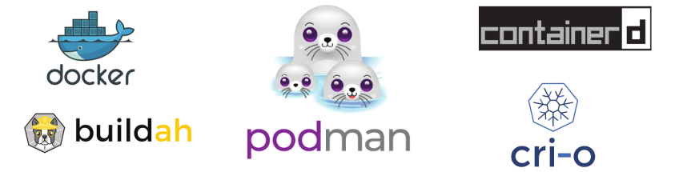
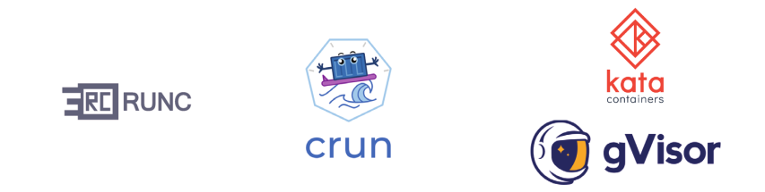

# Aplicaciones para trabajar con contenedores OCI

Antes de definir las distintas aplicaciones que nos proporciona Red Hat para trabajar con contenedores OCI, vamos a definir una serie de conceptos:

## Terminología sobre contenedores

* **Orquestador de contenedores**: es un programa que gestiona los contenedores que se ejecutan en un clúster de servidores. Nos ofrece muchas características: actualizaciones automáticas, balanceo de carga, tolerancia a fallos, escalabilidad,...

* **Motor de contenedores**: Software que nos permite gestionar contenedores en un nodo local. Los contenedores puedes ser creados por orquestadores, en ese caso se usan motores como **containerd** o **cri-o**, o pueden ser gestionados por usuarios, en este caso se utilizan motores como **Docker** o **Podman**.

* **Entorno de ejecución de contenedores (runtime container)**: Software encargado de configurar el sistema para ejecutar los contenedores. Lo más utilizados son **runc** y **crun**. Otros ejemplos de entornos de ejecución puedes ser **Kata** y **gVisor**.

## Conceptos relacionados con el trabajo con contenedores

* **Contenedor OCI**:
    * Cumplen la especificación desarrollada por la OCI.
    * Entorno aislado donde se ejecuta una aplicación. 
    * Tiene su propio sistema de ficheros con todas las dependencias que necesita la aplicación para funcionar. 
    * Puede estar conectado a una red virtual y utilizar almacenamiento adicional para no perder la información importante.
    * Utiliza los recursos del servidor donde se está ejecutando (núcleo del sistema operativo, CPU, RAM).    
    * Los contenedores suelen ejecutar un sólo proceso.
    * Los contenedores son efímeros.
* **Imagen OCI**: 
    * El formato de las imágenes cumplen la especificación desarrollado por la OCI. Del mismo modo, la distribución de dichas imágenes cumplen con la especificación OCI.
    * Una imagen es una plantilla de sólo lectura con instrucciones para crear un contenedor OCI. 
    * Contiene el sistema de fichero que tendrá el contenedor. 
    * Además establece el comando que ejecutará el contenedor por defecto. 
    * Podemos crear nuestras propias imágenes o utilizar las creadas por otros y publicadas en un registro. 
    * Un contenedor es una instancia ejecutable de una imagen. 
* **Registros de Imágenes**:
    * Un registro almacena imágenes.
    * Los registros pueden ser públicos o privados.
    * Tenemos un registro local donde se descargan las imágenes desde la que vamos a crear los contenedores.
    * Tenemos registros remotos desde donde podemos bajar las imágenes, o subirlas para su distribución.
    * Podman puede configurar y trabajar con distintos registros:
        * `docker.io`: El es registro público de Docker, llamado Docker Hub.
        * `quay.io`: Es un registro público de imágenes proporcionado por Red Hat.
        * `registry.access.redhat.com`: Es otro registro ofrecido por Red Hat, que ofrece imágenes de contenedores certificadas y soportadas por Red Hat Enterprise Linux (RHEL), OpenShift y otras tecnologías relacionadas con Red Hat.
        * `registry.fedoraproject.org`: Es un registro de imágenes de contenedores OCI mantenido por el Proyecto Fedora. Contiene imágenes de contenedores basadas en Fedora y otras tecnologías relacionadas con Fedora.
        * ...

## Herramientas de Red Hat para trabajar con contenedores

Podman, Buildah y Skopeo son tres herramientas relacionadas que se utilizan en el mundo de los contenedores. Aunque tienen funcionalidades diferentes, trabajan en conjunto para facilitar la construcción, ejecución y administración de contenedores. 

* **Podman**: Es un **motor de contenedores** de contenedores OCI, que permite a los usuarios crear, ejecutar y gestionar contenedores sin necesidad de un demonio (daemon) centralizado. Podman utiliza un enfoque basado en procesos, lo que lo hace más seguro y adecuado para entornos donde se requiere aislamiento y seguridad. 
* **Buildah**: Es una herramienta para la **construcción de imágenes de contenedores** sin necesidad de ejecutar un demonio. Permite a los usuarios construir imágenes de contenedores OCI desde cero o a partir de un contenedor existente sin necesidad de un fichero `Dockerfile`. 
* **Skopeo**: Es una herramienta que facilita la **gestión de imágenes de contenedores**. Permite a los usuarios copiar imágenes de un registro a otro, inspeccionar imágenes y firmas, y realizar otras operaciones relacionadas con imágenes sin necesidad de descargarlas en el sistema local. 
