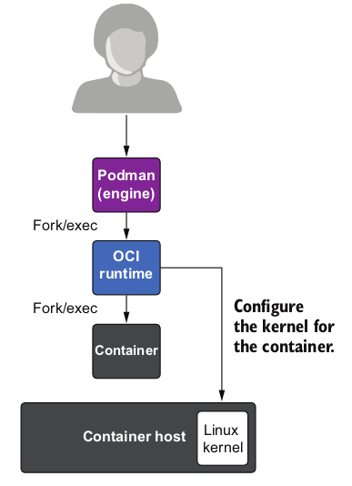

# Introducción a Podman

## Terminología sobre contenedores

* **Orquestador de contenedores**: es un programa que gestiona los contenedores que se ejecutan en un clúster de servidores. Nos ofrece muchas características: actualizaciones automáticas, balanceo de carga, tolerancia a fallos, escalabilidad,...

* **Motor de contenedores**: Software que nos permite gestionar contenedores en un nodo local. Los contenedores puedes ser creados por orquestadores, en ese caso se usan motores com **containerd** o **cri-o**, o pueden ser gestionados por usuarios, en este caso se utilizan motores como **Docker** o **Podman**.

* **Entorno de ejecución de contenedores (runtime container)**: Software encargado de configurar el sistema para ejecutar los contenedores. Lo más utilizados son **runc** y **crun**. Otros ejemplos de entornos de ejecución puedes ser **Kata** y **gVisor**.

## Podman

* **Podman (the POD MANager)** es una herramienta para gestionar contenedores e imágenes OCI, volúmenes montados en esos contenedores y Pods (grupos de contenedores). 
* Podman ejecuta contenedores en **Linux**, pero también puede utilizarse en sistemas **Mac y Windows** utilizando una máquina virtual gestionada por Podman. 
* Podman se basa en **libpod**, una biblioteca para la gestión del ciclo de vida de los contenedores. La librería libpod proporciona APIs para la gestión de contenedores, pods, imágenes de contenedores y volúmenes.
* Podman es una herramienta nativa de Linux, de **código abierto** y **sin demonio**, diseñada para facilitar la búsqueda, ejecución, creación, uso compartido y despliegue de aplicaciones mediante contenedores e imágenes OCI.
* Podman proporciona una interfaz de línea de comandos (CLI) familiar para cualquiera que haya utilizado el motor de contenedores Docker. 
* Podman se basa en un OCI runtime (runc, crun, ...) para interactuar con el sistema operativo y crear los contenedores en ejecución. 

## Elementos fundamentales de Podman

* **Contenedor OCI**:
    * Cumplen la especificación desarrollada por la OCI.
    * Entorno aislado donde se ejecuta una aplicación. 
    * Tiene su propio sistema de ficheros con todas las dependencias que necesita la aplicación para funcionar. 
    * Puede estar conectado a una red virtual y utilizar almacenamiento adicional para no perder la información importante.
    * Utiliza los recursos del servidor donde se está ejecutando (núcleo del sistema operativo, CPU, RAM).    
    * Los contenedores suelen ejecutar un sólo proceso.
    * Los contenedores son efímeros
* **Imagen OCI**: 
    * El formato de las imágenes cumplen la especificación desarrollado por la OCI. Del mismo modo, la distribución de dichas imágenes cumplen con la especificación OCI.
    * Una imagen es una plantilla de sólo lectura con instrucciones para crear un contenedor OCI. 
    * Contiene el sistema de fichero que tendrá el contenedor. 
    * Además establece el comando que ejecutará el contenedor por defecto. 
    * Podemos crear nuestras propias imágenes o utilizar las creadas por otros y publicadas en un registro. 
    * Un contenedor es una instancia ejecutable de una imagen. 
* **Registros de Imágenes**:
    * Un registro almacena imágenes.
    * Los registros pueden ser públicos o privados.
    * Tenemos un registro local donde se descargan las imágenes desde la que vamos a crear los contenedores.
    * Tenemos registros remotos desde donde podemos bajar las imágenes, o subirlas para su distribución.
    * Podman puede configurar y trabajar con distintos registros:
        * `docker.io`: El es registro público de Docker, llamado Docker Hub.
        * `quay.io`: Es un registro público de imágenes proporcionado por Red Hat.
        * `registry.access.redhat.com`: Es otro registro ofrecido por Red Hat, que ofrece imágenes de contenedores certificadas y soportadas por Red Hat Enterprise Linux (RHEL), OpenShift y otras tecnologías relacionadas con Red Hat.
        * `registry.fedoraproject.org`: Es un registro de imágenes de contenedores OCI mantenido por el Proyecto Fedora. Contiene imágenes de contenedores basadas en Fedora y otras tecnologías relacionadas con Fedora.

## Características principales de Podman

### Línea de comandos amigable

Podman se ha desarrollado después de Docker, por lo que sus creadores se han basado en muchas de sus funcionalidades. Entre ellas, el CLI, las opciones de línea de comandos de podman son muy similares al CLI de Docker, por lo que en un primer momento basta con cambiar el comando `docker` por `podman` y podemos empezar a trabajar con contenedores. Muchas distribuciones Linux ofrecen un paquete llamado `podman-docker` que añade un alias para que al poner el comando `docker` se ejecute el comando `podman`.

### Contenedores rootless

Probablemente la característica más significativa de Podman es su capacidad para contenedores por un usuario sin privilegios. No es necesario usar `root` para la ejecución de contenedores.

Esto es util, cuando queremos que cualquier usuario del sistema pueda ejecutar contenedores y construir imágenes de contenedores, sin requerir acceso de `root`. 

Esta característica nos ofrece un alto grado de seguridad en la ejecución de contenedores.

Aunque en Docker también se puede hacer uso de esta [característica](https://docs.docker.com/engine/security/rootless/), su implantación se ha introducido en versiones más nueva del producto. sin embargo, en Podman está característica fue desarrolla desde el comienzo del proyecto.

### Arquitectura Fork/Exec

Docker posee una arquitectura cliente-servidor. el cliente Docker se conecta al demonio Docker para gestionar el contenedor. Podemos entender el demonio docker como un intermediario entre el Docker CLI y el OCI runtime que gestiona el contenedor. Veamos el diagrama:

En resumen, el cliente Docker se comunica con el demonio Docker, que a su vez se comunica con el demonio containerd, que finalmente lanza un OCI runtime como runc para lanzar el contenedor. La gestión de contenedores es compleja, y cualquier fallo en los elementos involucrados pueden hacer que el contenedor no funcione de manera adecuada.

Podman sigue el modelo fork/Exec, que tradicionalmente ha funcionado en los sistemas Unix: cuando ejecutamos un nuevo programa, un proceso padre (por ejemplo, `bash`) ejecuta el nuevo programa como un proceso hijo.

En el caso de Podman, al crear un contenedor se crea un proceso hijo, del proceso correspondiente qal OCI runtime. Veamos un esquema de este mecanismo:

Este mecanismo de creación de contenedores es mucho más sencillo y nos proporciona una manera más segura de trabajar con contenedores.

### Podman no tiene demonio

Como hemos visto anteriormente, Podman es un software *daemonless*. La diferencia fundamental entre Podman y docker, es que Podman no tiene un demonio en ejecución. Podman realiza las mismas operaciones que docker sin necesidad de tener un proceso demonio en ejecución que gestione el ciclo de vida de los contenedores.

Sin embargo para permitir que otros programas puedan usar Podman como gestor de contenedores, Podman puede ofrecer una API REST compatible con la ofrecida por Docker. 

### Integración con systemd

Systemd es el principal sistema de inicialización en los sistemas operativos Linux. Es el repsonsable de crear el proceso `init` que inicializa el espacio de usuario durante el proceso de arranque de Linux y gestionar posteriormente todos los demás procesos.

Podman puede integrar completamente la ejecución de contenedores con el sistema de systemd. Por lo tanto, podemos usar systemd para gestionar el ciclo de vida de los contenedores.

Los contenedores trabajan como unidades de systemd que podemos invocar como si fueran cualquier otro proceso.

### Pods

Una de las ventajas de Podman se el trabajo con Pods. Un Pod es una envoltura ("vaina") de uno o más contenedores, con recursos compartidos de almacenamiento y red, y una especificación de cómo ejecutar los contenedores.

Podman puede trabaja con un solo contenedor a la vez, o puede gestionar grupos de contenedores juntos en un Pod. Los Pods permiten agrupar varios servicios para formar un servicio mayor gestionado como una entidad única. 

Además, Podman es capaz de generar archivos YAML de de Kubernetes a partir de contenedores y Pods en ejecución.

### Registros de contenedores personalizables

Con Podman podemos gestionar imágenes OCI usando su nombre corto, sin necesidad de indicar el nombre del registro. 

Por ejemplo, el nombre de imagen `ubi8`corresponde al nombre completo `registry.access.redhat.com/library/ubi8:latest`, donde se indica los nombres del registro, del repositorio, de la imagen y de la etiqueta.

En Podman podemos especificar múltiples registros, de tal forma que cuando indicamos el nombre de una imagen, se nos da a elegir entre los distintos registros que tenemos configurados.

