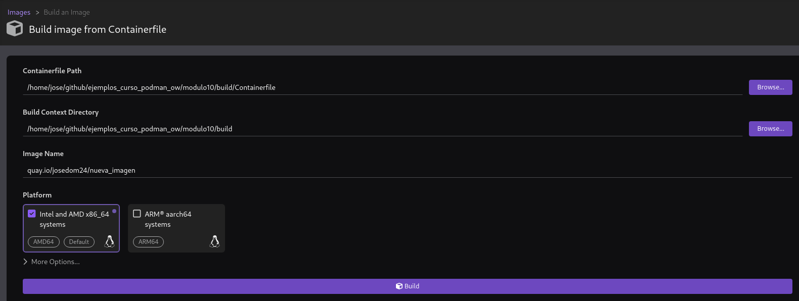
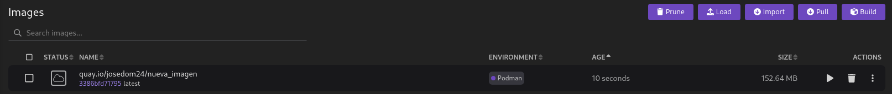
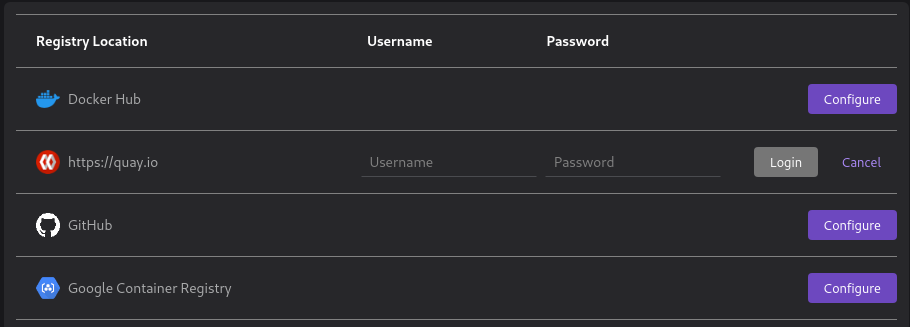
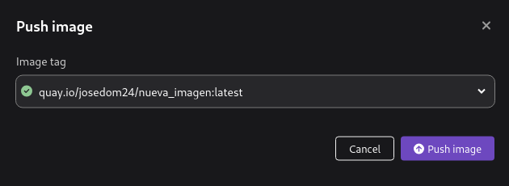

# Construcción de imágenes en Podman Desktop

Con la opción **Build** de Podman Desktop podemos construir una nueva imagen a partir de un fichero `Containerfile`. Cuando queremos crear un nueva imagen tendremos que introducir la siguiente información:

* El fichero `Containerfile`.
* El directorio de contexto.
* El nombre de la nueva imagen, con el nombre del registro si lo vamos a subir a un registro remoto.
* La plataforma de ejecución.

Una vez construida la imagen, podemos comprobar que se ha creado desde la sección de imágenes:

Ahora podríamos crear un nuevo contenedor a a partir de esta nueva imagen, o por ejemplo, subir la imagen a un repositorio remoto. Para ello lo primero es loguearnos en un registro remoto. Para llo, elegimos en la configuración, la gestión de registros y elegimos en el que nos queremos loguear:

Y a continuación elegimos la opción **Push image**:

Y ya la tendremos subida al registro seleccionado.

