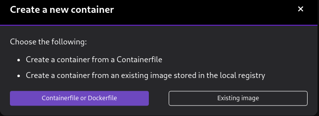
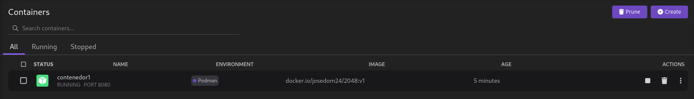

# Gestión de contenedores en Podman Desktop

En el apartado de **Contenedores** podemos gestionar nuestros contenedor. Podemos crear un nuevo contenedor, y nos permitirá elegir entre:

* La creación de una imagen desde un fichero `Containerfile` para crear el contenedor.
* Elegir una imagen existente para la creación del contenedor.

Podemos crear un contenedor desde una imagen existente, eligiendo la operación **Run image**. Para la creación de un nuevo contenedor nos parece un formulario con distintas opciones, veamos las más importantes:

* Basic:
    * Nombre del contenedor.
    * El comando que se ejecuta en el contenedor.
    * Volúmenes asociados.
    * Mapeo de puertos.
    * Variables de entorno.
* Advance:
    * Ejecutar un terminal, similar a la opción `-t` de `podman run` que nos permitirá conectarnos al contenedor.
    * El usuario que ejecuta los procesos del contenedor.
* Networking
    * El hostname del contenedor.
    * Un DNS específico.
    * Añadir nombres en la resolución estática.
    * Elegir tipo de red.
* Security: Opciones avanzadas sobre seguridad.

Podemos obtener la lista de todos los contenedores, los que se están ejecutando y los que están parados.
Las operaciones que podemos realizar sobre un contenedor son:

* Para el contenedor.
* Eliminar el contenedor.
* Obtener los logs del contenedor.
* Generar el manifiesto YAML a a partir del contenedor y desplegarlo en Kubernetes.
* Abrir el navegador para acceder a la aplicación.
* Abrir el terminal en el contenedor.
* Reiniciar el contenedor.
* Exportar el contenedor.

## Compose en Podman Desktop

Podman Desktop nos permite visualizar los contenedores creados con un Compose. Por ejemplo, si ejecutamos el fichero `compose.yaml` de la aplicación Guestbook, podremos visualizar y gestionar los contenedores en Podman Desktop:

