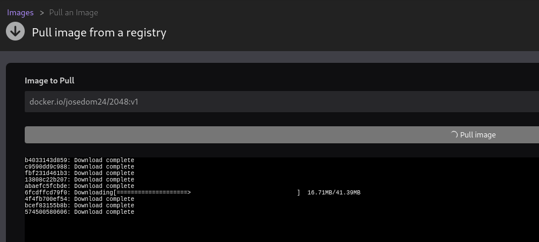
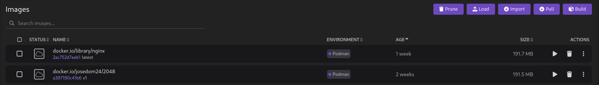

# Gestión de imágenes en Podman Desktop

Desde el apartado imágenes de Podman Desktop, podemos gestionar las imágenes que tenemos en el registro local.

Podemos realizar las siguiente operaciones:

* **Load**: Cargar una imagen desde un fichero tar, similar a `podman load`.
* **Import**: Nos permite importar un contenedor en un fichero tar.
* **Pull**: Nos permite bajar una imagen de un registro remoto.
* **Build**: Nos permite construir nuevas imágenes.

Podemos descargar una imagen desde un registro remoto:



De cada imagen que tenemos en nuestro registro local podemos realizar las siguientes acciones:

* Ejecutar un contenedor.
* Eliminar la imagen.
* Subir la imagen a un registro remoto.
* Editar la imagen, permite cambiar el nombre y la etiqueta de la imagen.
* Guardar la imagen en un fichero tar.
* Inspeccionar la imagen.
* Ver el historial de la imagen.

Si descargamos desde la línea de comando una imagen, la podremos ver en Podman Desktop:

```
$ podman pull docker.io/nginx
```

