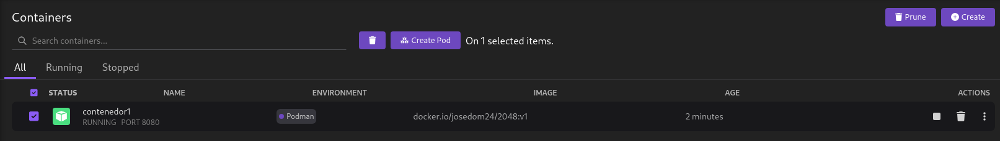
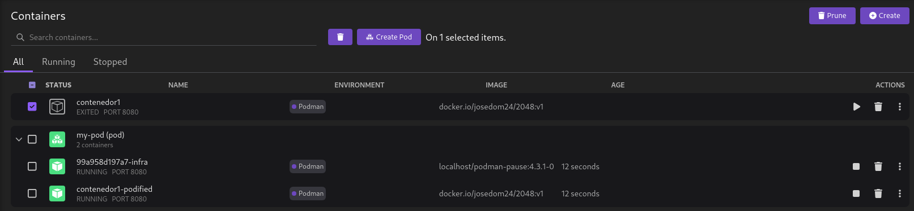
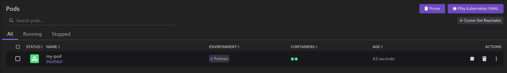
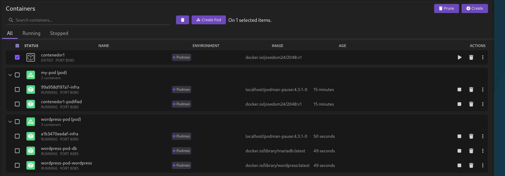
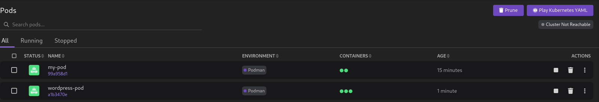

# Gestión de Pods en Podman Desktop

Desde la sección **Pods** de Podman Desktop podemos gestionar los Pods con los que estemos trabajando. Desde la interfaz de Podman Desktop podemos crear Pods de dos formas distintas:

## Creación de Pods desde contenedores

Si elegimos unos o varios contenedores en ejecución, nos aparece la opción **Create Pod**, que nos permite la creación de un Pod con los contenedores seleccionados:

Al crear unPod indicamos el nombre y el puerto que se va a mapear. Poedmos observar que el contenedor de origen se ha detenido, y se ha creado un Pod con dos contenedores: el infra y el seleccionado anteriormente.

En la sección de **Pods** veremos el Pod que hemos creado:

Las operaciones que se pueden realizar sobre los Pods son las siguientes:

* Parar la ejecución del Pod.
* Eliminar el Pod.
* Generar el manifiesto YAML a a partir del Pod y desplegarlo en Kubernetes.
* Reiniciar el Pod.
* Acceder a los logs de los contenedores.
* Inspeccionar el Pod.
* Abrir el navegador para acceder a la aplicación.

## Creación de Pods desde ficheros YAML

Otra forma de crear Pods en Podman DEsktop es desde un fichero YAML con recursos de Kubernetes.
Para ello elegimos la opción **Play Kubernetes YAML**, que nos permitirá elegir un fichero YAML con los recursos que queremos crear.

Por ejemplo, podemos ejecutar el fichero `wp-mariadb-pod.yaml` que utilizamos en el apartado [Ejecutando recursos de Kubernetes en Podman](contenido/modulo5/kubernetes2.md). Y comprobamos los contenedores que se han creado:

Y los Pods que se han creado:

