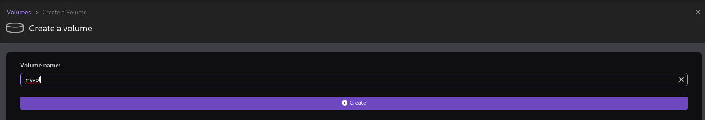
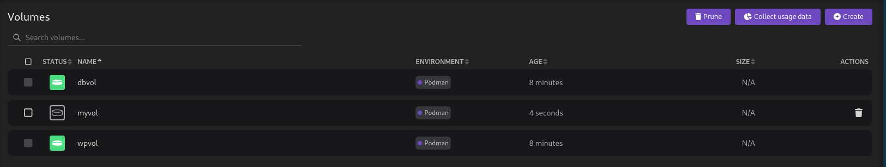

# Gestión de volúmenes en Podman Desktop

En la sección de **volúmenes** de Podman Desktop, gestionamos los volúmenes con los que estamos trabajando.

Podemos crear un nuevo volumen indicando el nombre:

Y podremos ver los volúmenes que hemos creado:

Con la opción **Collect usage data** se calcula el tamaño del almacenamiento de cada volumen. Además podemos inspeccionar un volumen y borrarlo.