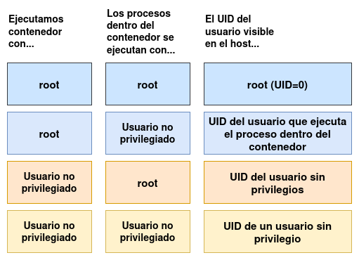

# Modos de funcionamiento de los contenedores

Antes de estudiar el funcionamiento de los contenedores rootless, vamos a ver los modos de funcionamiento de los contenedores en Podman.

## Ejecución de contenedores Rootful

Como hemos indicado un contenedor rootful es un contenedor ejecutado por `root` en el host. Pero, ¿qué usuario ejecuta los procesos dentro del contenedor?. La respuesta a esta pregunta nos ofrece dos posibilidades:

### Ejecución de contenedores rootful, con procesos en el contenedor ejecutándose como root

Veamos un ejemplo (el prompt `#` indica que los comandos se están ejecutando como `root`):

```
# id
uid=0(root) gid=0(root) groups=0(root) context=unconfined_u:unconfined_r:unconfined_t:s0-s0:c0.c1023

# podman run -d --rm --name contenedor1 alpine sleep 1000
c7cbb189f807fba22a77b465586f9d1e048f199ebca6b674fe8d82fc9be82f5b

# podman exec contenedor1 id
uid=0(root) gid=0(root)

# ps -ef | grep sleep
root       22702   22700  0 08:59 ?        00:00:00 sleep 1000

# podman top contenedor1 huser user 
HUSER       USER
root        root
```

1. En primer lugar vemos que el usuario que va a crear el contenedor es `root`.
2. Comprobamos que el usuario que está ejecutando los procesos dentro del contenedor es `root`.
3. Comprobamos que en el host, el proceso lo ejecuta el usuario `root`.
4. Por último, vemos con la instrucción `podman top`, que el usuario correspondiente al host (`HUSER`) es `root`, y el usuario dentro del contenedor (`USER`) también es `root`.

Podemos concluir: cuando ejecutamos un contenedor como `root`, con el proceso del contenedor ejecutándose como `root`, el usuario real visible en el host que ejecuta el proceso es `root` con UID 0.

### Ejecución de contenedores rootful, con procesos en el contenedor ejecutándose con usuarios no privilegiados

Al ejecutar un contenedor podemos usar el parámetro `--user` o `-u` para indicar el usuario que se utilizará dentro del contenedor para ejecutar los procesos. El usuario también puede venir indicado en la imagen que estemos utilizando. Veamos un ejemplo:

```
# id
uid=0(root) gid=0(root) groups=0(root) context=unconfined_u:unconfined_r:unconfined_t:s0-s0:c0.c1023

# podman run -d --rm -u sync --name contenedor1 alpine sleep 1000
6bf3ec46d7f391e3240cbce4e159adfea7d780435f3d324023a8b0875b83fa56

# podman exec contenedor1 id
uid=5(sync) gid=0(root)

#  ps -ef | grep sleep
sync       23135   23133  0 09:37 ?        00:00:00 sleep 1000

# podman top contenedor1 huser user 
HUSER       USER
sync        sync
```
En este caso:

1. En primer lugar vemos que el usuario que va a crear el contenedor es `root`.
2. Comprobamos que el usuario que está ejecutando los procesos dentro del contenedor es `sync`.
3. Comprobamos que en el host, el proceso lo ejecuta el usuario `sync`.
4. Por último, vemos que el usuario correspondiente al host (`HUSER`) es `sync`, y el usuario dentro del contenedor (`USER`) también es `sync`.

Podemos concluir: cuando ejecutamos un contenedor como `root`, con el proceso del contenedor ejecutándose por un usuario sin privilegios, el usuario real visible en el host que ejecuta el proceso es el usuario sin privilegio, con el UID del usuario que ejecuta el proceso dentro del contenedor.

## Ejecución de contenedores rootless

Veamos ahora cómo se comportan las asignación de usuarios cuando ejecutamos contenedores rootless. En nuestro caso, vamos a a usar el usuario `usuario` con UID 1000 para crear los contenedores. De la misma forma que anteriormente, podemos ejecutar los procesos dentro del contenedor con diferente usuarios:

### Ejecución de contenedores rootless, con procesos en el contenedor ejecutándose como root

Veamos un ejemplo:

```
$ id
uid=1000(usuario) gid=1000(usuario) groups=1000(usuario),4(adm),10(wheel),190(systemd-journal) context=unconfined_u:unconfined_r:unconfined_t:s0-s0:c0.c1023

$ podman run -d --rm --name contenedor1 alpine sleep 1000
f3961860f97280adf64c44a8b42dd39588712d3935469bf97d3ae7d71b8ffa97

$ podman exec contenedor1 id
uid=0(root) gid=0(root)

$ ps -ef | grep sleep
usuario     23234   23232  0 09:47 ?        00:00:00 sleep 1000

$ podman top contenedor1 huser user
HUSER       USER
1000        root
```

1. En primer lugar vemos que el usuario que va a crear el contenedor es `usuario`.
2. Comprobamos que el usuario que está ejecutando los procesos dentro del contenedor es `root`.
3. Comprobamos que en el host, el proceso lo ejecuta el usuario `usuario`.
4. Por último, vemos que el usuario correspondiente al host (`HUSER`) es `usuario` (UID 1000), y el usuario dentro del contenedor (`USER`) es `root`. **Hay una correspondencia entre nuestro usuario sin privilegios en el host y el usuario `root` dentro del contenedor**.

Podemos concluir: cuando ejecutamos un contenedor con un usuario sin privilegios, con el proceso del contenedor ejecutándose con `root`, el usuario real visible en el host que ejecuta el proceso es el usuario sin privilegio con su UID.

### Ejecución de contenedores rootful, con procesos en el contenedor ejecutándose con usuarios no privilegiados

En el caso de los contenedores rootless, también podemos indicar el usuario que ejecutara los procesos dentro del contenedor con el parámetro `--user` o `-u`, o utilizando una imagen donde venga definido. Veamos un ejemplo:

```
$ id
uid=1000(usuario) gid=1000(usuario) groups=1000(usuario),4(adm),10(wheel),190(systemd-journal) context=unconfined_u:unconfined_r:unconfined_t:s0-s0:c0.c1023

$ podman run -d --rm -u sync --name contenedor1 alpine sleep 1000
96d64bf75b7998de86624dd699f450f83670b4a798e775585edc8c2607de94ca

$ podman exec contenedor1 id
uid=5(sync) gid=0(root)

$ ps -ef | grep sleep
524292     23377   23375  0 09:57 ?        00:00:00 sleep 1000

$ podman top contenedor1 huser user
HUSER       USER
524292      sync
```

En este caso:

1. En primer lugar vemos que el usuario que va a crear el contenedor es `usuario`.
2. Comprobamos que el usuario que está ejecutando los procesos dentro del contenedor es `sync`.
3. Comprobamos que en el host, el proceso lo ejecuta un usuario con UID 524292.
4. Por último, vemos que el usuario correspondiente al host (`HUSER`)es un usuario con UID 524292, y el usuario dentro del contenedor (`USER`) es `sync`. **Hay una correspondencia entre un usuario sin privelegios en el host y el usuario `sync` dentro del contenedor**.

Podemos concluir: cuando ejecutamos un contenedor con un usuario sin privilegios, con el proceso del contenedor ejecutándose con un usuario sin privilegios, el usuario real visible en el host que ejecuta el proceso es otro usuario sin privilegios con un UID propio.

En resumen:




## Ejemplos de modos de funcionamiento de los contenedores

Veamos cómo podemos ejecutar contenedores con un servidor web usando los cuatro modos que hemos estudiado. Para ello, vamos a utilizar dos imágenes:

* `docker.io/nginx`: Imagen oficial del servidor web nginx. El proceso de nginx se ejecuta dentro del contenedor con el usuario `root`. El servicio se ofrece en el puerto 80/tcp.
* `dokcer.io/bitnami/nginx`: Imagen de la empresa bitnami, que ofrece un servidor web nginx. El proceso nginx se ejecuta dentro del contenedor con un usuario sin privilegios, por lo tanto dentro del contenedor el usuario no puede usar el puerto 80/tcp, se ejecuta nginx en el puerto 8080/tcp.

**Ejecución de contenedores rootful, con procesos en el contenedor ejecutándose como root**

```
$ sudo podman run -d -p 80:80 --name webserver docker.io/nginx
```

**Ejecución de contenedores rootful, con procesos en el contenedor ejecutándose con usuarios no privilegiados**

```
$ sudo podman run -d -p 80:8080 --name webserver docker.io/bitnami/nginx
```

**Ejecución de contenedores rootless, con procesos en el contenedor ejecutándose como root**

```
$ podman run -d -p 8080:80 --name webserver docker.io/nginx
```

**Ejecución de contenedores rootful, con procesos en el contenedor ejecutándose con usuarios no privilegiados**

```
$ podman run -d -p 8080:8080 --name webserver docker.io/bitnami/nginx
```

