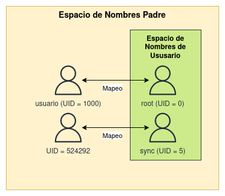

# ¿Cómo funcionan los contenedores rootless?

## Espacio de nombres de usuario

Los espacios de nombres (**namespaces**) son un mecanismo que el kernel de Linux utiliza para aislar y restringir recursos del sistema operativo, como procesos, redes, sistemas de archivos, entre otros. Los namespaces permiten crear entornos de ejecución independientes

Cuando ejecutamos contenedores rootless, hemos visto que podemos ejecutar los procesos dentro del contenedor con otros usuarios. Además dentro de la imagen que estamos usando para crear el contenedor pueden estar definidos varios usuarios. Sin embargo, el kernel de Linux impide a un usuario sin privilegios usar más de un UID, por ello necesitamos un mecanismo que consiga que nuestro usuario sin privilegio pueda utilizar distintos UID y GID.

Es por todo ello, que se use un espacio de nombre de usuario (**user username**):

* Nos permite **asignar un rango de IDs de usuario y grupo** en un espacio de nombres aislado. Esto significa que los procesos que se ejecutan dentro de ese namespace tienen una visión limitada de los usuarios y grupos del sistema en comparación con el sistema anfitrión. 
* Nos permite establecer una correspondencia entre los ID de usuario del contenedor y los ID de usuario del host.
* En el espacio de nombres de usuario de Podman, hay un nuevo conjunto de IDs de usuario e IDs de grupo, que están separados de los UIDs y GIDs de su host.

Por ejemplo, como vimos en los ejemplos anteriores:

* Cuando creamos un contenedor rootless donde se ejecutan los procesos como `root` (uid = 0), en el host se están ejecutando con el usuario que ha creado el contenedor, en nuestro caso con el usuario `usuario` (uid = 1000).
* Cuando creamos un contenedor rootless donde se ejecutan los procesos con el usuario `sync` (uid = 5), en el host se están ejecutando con un usuario sin privilegios con uid = 524292.



Cada usuario no privilegiado que creemos en nuestro host, tendrá un conjunto de UID y GID que podrá mapear a usuarios y grupos dentro del contenedor:

* En el fichero `/etc/subuid`, por cada usuario tenemos el UID inicial y la cantidad de identificadores que puede mapear. Cada usuario tiene que tener un conjunto de identificadores diferentes.
    ```
    $ cat /etc/subuid
    usuario:524288:65536
    ```

    El usuario `usuario` puede mapear desde el UID 524288 y tiene asignado 65536 identificadores.
* En el fichero `/etc/subgid` está definido, con el mismo formato los identificadores de grupos que puede mapear cad usuario.

Podemos ver el mapeo de identificadores de usuario que se ha realizado leyendo el fichero `/proc/self/uid_amp` en el contenedor. Si ejecutamos la siguiente instrucción en el último ejemplo que hemos presentado (contenedor rootless cuyos procesos se ejecuta por el usuario `sync`):

```
$ podman exec contenedor1 cat /proc/self/uid_map
         0       1000          1
         1     524288      65536
```

El mapeo que se ha realizado es el siguiente:

* El usuario `root` (UID = 0) está mapeado con el usuario `usuario` (UID = 1000) para un rango de 1. 
* Luego el UID 1 está mapeado al UID 524288 para un rango de 65536 UIDS. Por eso el usuario `sync` con UID = 5, se mapea al UID = 524292.

Desde el punto de vista de la seguridad es un aspecto muy positivo, ya que la ejecución del contenedor y de los procesos dentro del contenedor se hace por usuarios diferentes y sin privilegios. El rango de IDs que mapea un usuario, no tiene ningún privilegio especial en el sistema, ni siquiera como el usuario `usuario` (UID = 1000). Esto significa que si un proceso en el contenedor tiene un problema de seguridad estará restringido en el host del contenedor.

Por lo tanto el uso de contenedores rootless aumenta la seguridad consiguiendo un **aislamiento de privilegios**, ya que al ejecutar contenedores en modo rootless, el usuario no necesita privilegios de superusuario para iniciar y administrar los contenedores. Además como se usan un conjunto de IDs de usuario y grupo dentro del contenedor que son diferentes de los IDs en el sistema anfitrión, nos proporciona una capa adicional de aislamiento de seguridad, ya que los procesos dentro del contenedor no tienen privilegios en el sistema anfitrión. Dicho de otro modo, se reduce el riesgo de que un contenedor comprometido pueda acceder o modificar recursos críticos del sistema anfitrión.

## podman unshare

La instrucción `podman unshare`, nos permite entrar en un espacio de nombres de usuario sin lanzar un contenedor. Le permite examinar lo que está sucediendo dentro del espacio de nombres de usuario, cambiado el conjuntos de IDs que se está usando para identificar a los usuarios y los grupos.

Por ejemplo, si ejecutamos la siguiente instrucción en el host:

```
$ cat /proc/self/uid_map
         0          0 4294967295
```

Se nos muestra el mapeo en los contenedores roorful, el ID 0 se mapea con el 0, y así sucesivamente con todos el rango de identificadores.

Sin embargo, podemos entrar en el espacio de nombre de usuario y ejecutar esa misma instrucción:

```
$ podman unshare cat /proc/self/uid_map
         0       1000          1
         1     524288      65536
```

Obteniendo el mismo resultado que al ejecutarla dentro del contenedor.