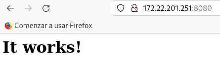
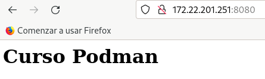

# Ejecución de un contenedor demonio con un servidor web

En este ejemplo vamos a crear un contenedor demonio que ejecuta un servidor web Apache, para ello vamos a usar la imagen `httpd:2.4` del registro **Docker Hub** (en este caso hemos indicado el nombre de la imagen y su etiqueta `2.4` que nos indica la versión del servidor web que vamos a usar). Podemos crear un contenedor rootful:

```
$ sudo podman run -d --name my-apache-app -p 80:80 docker.io/httpd:2.4
```

O podemos crear un contenedor rootless, teniendo en cuenta que no podemos utilizar los puertos privilegiados (menores del 1024), por lo que en este caso hemos mapeado el puerto 8080:

```
$ podman run -d --name my-apache-app -p 8080:80 docker.io/httpd:2.4
```

Hay que tener en cuenta que los contenedores rootful que estamos creando se conectan a una red virtual privada (más adelante estudiaremos la conexión de red de los contenedores rootless) y que toman direccionamiento dinámico. No solemos usar la dirección IP del contenedor para acceder al servicio que nos ofrece. Con la opción `-p` mapeamos un puerto del host, con el puerto del servicio ofrecido por el contenedor. Si accedemos a la dirección IP del ordenador que tiene instalado Podman al primer puerto indicado, se redireccionará la petición a la dirección IP del contenedor al segundo puerto indicado. **Nunca utilizamos directamente la dirección IP del contenedor para acceder a él**. 

Podemos ver los puertos que están mapeados en un contenedor de dos maneras distintas. Usando el comando `podman port`:

```
$ podman port my-apache-app
80/tcp -> 0.0.0.0:8080
```

Para probarlo accedemos desde un navegador web:

* Si estamos accediendo desde el host, accederemos a `http://localhost:8080`.
* Si estamos accediendo desde un ordenador remoto, accederemos a la dirección IP del host y al puerto, por ejemplo, si la dirección IP del host es `172.22.201.251`, accederemos a `http://172.22.201.251:8080`:



Para acceder al log del contenedor podemos ejecutar:

```
$ podman logs my-apache-app
```

## Modificación del contenido servido por el servidor web

Si consultamos la documentación de la imagen [`httpd`](https://hub.docker.com/_/httpd) en el registro Docker Hub, podemos determinar que el servidor web que se ejecuta en el contenedor guarda los ficheros que sirve (directorio *DocumentRoot*) en `/usr/local/apache2/htdocs/`. Vamos a crear un nuevo fichero `index.html` en ese directorio.

Lo podemos hacer de varias formas:

* Accediendo de forma interactiva al contenedor y haciendo la modificación:

    ```
    $ podman exec -it my-apache-app bash

    root@cf3cd01a4993:/usr/local/apache2# cd /usr/local/apache2/htdocs/
    root@cf3cd01a4993:/usr/local/apache2/htdocs# echo "<h1>Curso Podman</h1>" > index.html
    root@cf3cd01a4993:/usr/local/apache2/htdocs# exit
    ```

* Ejecutando directamente el comando de creación del fichero `index.html` en el contenedor:

    ```
    $ podman exec my-apache-app bash -c 'echo "<h1>Curso Podman</h1>" > /usr/local/apache2/htdocs/index.html'
    ```

* Usando el comando `podman cp` y copiando el fichero `index.html` al contenedor:

    ```
    $ echo "<h1>Curso Podman</h1>" > index.html
    $ podman cp index.html  my-apache-app:/usr/local/apache2/htdocs/
    ```
    
Independientemente de cómo hayamos creado el fichero, podemos volver a acceder al servidor web y comprobar que efectivamente hemos cambiado el contenido del `index.html`:

