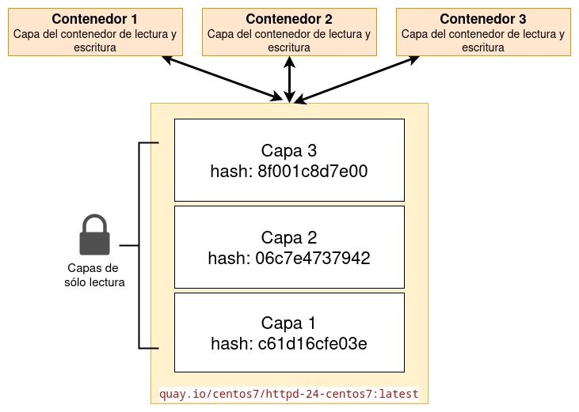
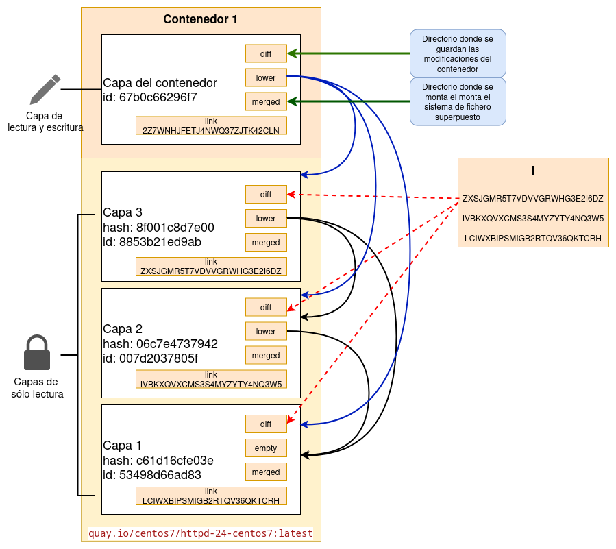

# Almacenamiento de contenedores

Cuando creamos un contenedor a partir de una imagen ocurren la siguientes cosas:

* Cuando se crea un nuevo contenedor desde una imagen, su sistema de archivos será un sistema de archivos de unión cuyas capas inferiores (`lowerdir`) serán las capas de la imagen y la capa superior (`upperdir`) será una nueva capa que denominamos **capa del contenedor**, de lectura y escritura y donde se escribirán todas las diferencias del sistema de archivos del contenedor...
* Los **contenedores son efímeros**, por que cuando lo borramos, se borra la capa del contenedor, por lo que se pierde todos sus datos.
* Por lo tanto cuando creamos un contenedor, el almacenamiento en disco es muy pequeño, ya que las capas de la imagen desde las que se ha creado se comparten con el contenedor y la capa del contenedor en un primer momento tiene muy pocos ficheros.
* Si tenemos un contenedor creado a partir de una imagen, **esta imagen no se puede borrar** ya que sus capas forman parte del sistema de archivos del contenedor en ejecución.



## Creación de un contenedor

Vamos a crear un contenedor, y veremos que se crea la **capa del contenedor** de lectura y escritura, que será la capa superior en el sistema de archivo de unión. Esta nueva capa contendrá sólo las diferencias entre las inferiores. Para ello, ejecutamos:
 
```
$ sudo podman run -d --name contenedor1 quay.io/centos7/httpd-24-centos7:centos7
579635db3532e954d07927bdc32bd435bd082f03a0696ded072f04d762a18775
```

Y vamos a crear un fichero en el nuevo contenedor:

```
$ sudo podman exec contenedor1 bash -c "echo 'Ejemplo Podman' > /tmp/tmpfile.txt"
```

En el directorio de almacenamiento (`/var/lib/containers/storage/` en los contenedores rootful) tenemos un directorio llamado `overlay-containers` donde encontramos la información de almacenamiento de los contenedores que hemos creado:

```
$ ls overlay-containers
579635db3532e954d07927bdc32bd435bd082f03a0696ded072f04d762a18775  containers.json  containers.lock
```

El directorio que tiene como nombre el identificador del contenedor que hemos creado tiene información del contenedor, y en el fichero `containers.json` tenemos un índice de los contenedores que hemos creado:

```
$ cat overlay-containers/containers.json | jq
[
  {
    "id": "579635db3532e954d07927bdc32bd435bd082f03a0696ded072f04d762a18775",
    "names": [
      "contenedor1"
    ],
    "image": "d7af31210b288164c319bae740ca1281528390a3c5cee657e95f243670b49e6a",
    "layer": "67b0c66296f7957a0d82c8e48442ee0d7e3b3386dadde46cd8dadf3c90d40000",
    "metadata": "{\"image-name\":\"quay.io/centos7/httpd-24-centos7:centos7\",\"image-id\":\"d7af31210b288164c319bae740ca1281528390a3c5cee657e95f243670b49e6a\",\"name\":\"contenedor1\",\"created-at\":1711141194}",
    "created": "2024-03-22T20:59:54.545266929Z",
    "flags": {
      "MountLabel": "system_u:object_r:container_file_t:s0:c14,c100",
      "ProcessLabel": "system_u:system_r:container_t:s0:c14,c100"
    }
  }
]
```

En el campo `layer` tenemos el identificador de la **capa del contenedor**, donde se irán escribiendo las diferencias de los ficheros del contenedor respectos a las capas inferiores correspondientes a la imagen. Por otro lado, hay que indicar que esta capa es temporal, existe mientras exista el contenedor, es por lo que decimos que los **contenedores son efímeros**.


Por lo tanto podemos ver los ficheros que hemos escrito en esta capa:

```
$ ls overlay/67b0c66296f7957a0d82c8e48442ee0d7e3b3386dadde46cd8dadf3c90d40000/diff/tmp
tmpfile.txt
```

Finalmente vamos a fijarnos en el directorio donde se guarda información del contenedor. Este directorio se llama `userdata`:

```
# cd overlay-containers/ae697efd8d29d8d75988390c19cf787ed8057bacfb1cea82a93a2c36756f88ee/userdata/
[root@podman userdata]# ls
artifacts  attach  config.json  ctl  secrets  shm  winsz
```

Este directorio contiene varios archivos que se montan directamente en el contenedor para personalizarlo.


## Creación del sistema de ficheros de unión

Cuando se crea un nuevo contenedor se crea un nuevos sistema de archivo de unión que es el que utiliza el contenedor. Podemos verlo ejecutando la siguiente instrucción:

```
$ mount | grep overlay
...
overlay on /var/lib/containers/storage/overlay/67b0c66296f7957a0d82c8e48442ee0d7e3b3386dadde46cd8dadf3c90d40000/merged type overlay (rw,nodev,relatime,context="system_u:object_r:container_file_t:s0:c14,c100",lowerdir=/var/lib/containers/storage/overlay/l/ZXSJGMR5T7VDVVGRWHG3E2I6DZ:/var/lib/containers/storage/overlay/l/IVBKXQVXCMS3S4MYZYTY4NQ3W5:/var/lib/containers/storage/overlay/l/LCIWXBIPSMIGB2RTQV36QKTCRH,upperdir=/var/lib/containers/storage/overlay/67b0c66296f7957a0d82c8e48442ee0d7e3b3386dadde46cd8dadf3c90d40000/diff,workdir=/var/lib/containers/storage/overlay/67b0c66296f7957a0d82c8e48442ee0d7e3b3386dadde46cd8dadf3c90d40000/work,redirect_dir=on,uuid=on,metacopy=on)
...
```

* El directorio donde se han unido todo los directorios es el directorio `merged` de la capa del contenedor:
  ```
  $  ls /var/lib/containers/storage/overlay/67b0c66296f7957a0d82c8e48442ee0d7e3b3386dadde46cd8dadf3c90d40000/merged
  anaconda-post.log  bin  boot  dev  etc  home  lib  lib64  media  mnt  opt  proc  root  run  sbin  srv  sys  tmp  usr  var
  ```
* Las capas inferiores indicadas con el parámetro `lowedir` referencian a los enlaces simbólicos que tenemos guardados el directorio `overlay/l`. Estas capas serán de sólo lectura.
* La capa superior donde se guardan las diferencias del contenedor, es una capa de lectura y escritura referenciada por el parámetro `upperdir`.

También podemos ver los directorios que se usan para construir el sistema de archivo de unión examinando la configuración del contenedor:

```
$ podman inspect --format='{{range $key,$dir := .GraphDriver.Data}}{{$key}} = {{$dir}}\n{{end}}'  contenedor1
LowerDir = /var/lib/containers/storage/overlay/8853b21ed9ab4ab7fd6c118f5b1c11e974caa7e133a99981573434d3b6018cf0/diff:/var/lib/containers/storage/overlay/007d2037805f6ca87f969f06c81286a47d98664e3f62e5fd393ec3da08a55b3c/diff:/var/lib/containers/storage/overlay/53498d66ad83a29fcd7c7bcf4abbcc0def4fc912772aa8a4483b51e232309aee/diff
MergedDir = /var/lib/containers/storage/overlay/67b0c66296f7957a0d82c8e48442ee0d7e3b3386dadde46cd8dadf3c90d40000/merged
UpperDir = /var/lib/containers/storage/overlay/67b0c66296f7957a0d82c8e48442ee0d7e3b3386dadde46cd8dadf3c90d40000/diff
WorkDir = /var/lib/containers/storage/overlay/67b0c66296f7957a0d82c8e48442ee0d7e3b3386dadde46cd8dadf3c90d40000/work
```

Visto de forma gráfica:




## Ejemplo de almacenamiento de contenedores

Al crear el contenedor, el tamaño de la **capa del contenedor** es muy pequeño, ya que sólo guarda las diferencias respecto a las capas inferiores.
En nuestro caso la imagen tiene un tamaño de 356 MB. Hemos creado un contenedor y le hemos copiado un fichero. Veamos el tamaño del contenedor con la opción `-s` (size) del comando `podman ps`:

```
$ sudo podman ps -s
CONTAINER ID  IMAGE                                    COMMAND               CREATED     STATUS      PORTS       NAMES        SIZE
579635db3532  quay.io/centos7/httpd-24-centos7:centos7  /usr/bin/run-http...  ... ago     Up ...                 contenedor1  38.7kB (virtual 357MB)
```

Vemos que el tamaño real del contenedor es 38.7 kB, aunque el sistema de archivos del contenedor (tamaño virtual) es de 357 MB. Este tamaño es el de la imagen, cuyo sistema de ficheros se comparte con el contenedor.

Si creamos un nuevo fichero en el contenedor, aumenta el tamaño del contenedor, en realidad la **Capa del Contenedor** de lectura y escritura ha aumentado ya que hemos creado un nuevo fichero.

Por todo lo que hemos explicado, ahora se entiende  que **no podemos eliminar una imagen cuando tenemos contenedores creados a a partir de ella**.

```
$ sudo podman rmi quay.io/centos7/httpd-24-centos7:centos7
Error: image used by 579635db3532e954d07927bdc32bd435bd082f03a0696ded072f04d762a18775: image is in use by a container: consider listing external containers and force-removing image
```

