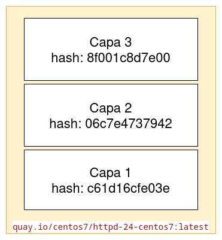
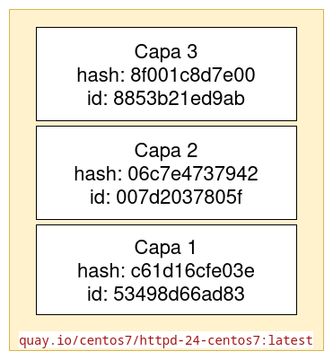
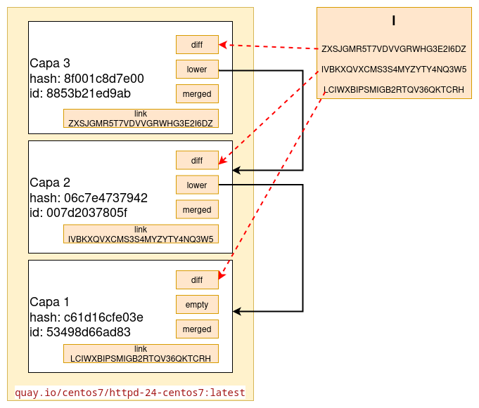
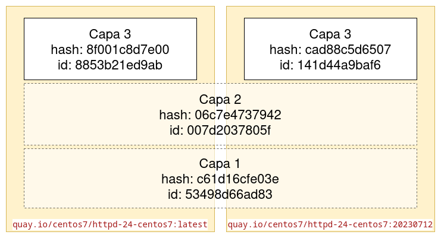

# Almacenamiento de imágenes

Las imágenes de contenedor se construyen a partir de de dos elementos:

* Una configuración: donde se guarda la metainformación de la imagen, por ejemplo se indica el comando que se ejecuta en el contenedor que ejecutemos a a partir de la imagen.
* Un sistema de archivos de unión, que estará formado por varias **capas ordenadas**. 

Veamos las implicaciones que tiene el uso de sistemas de archivos de unión en la estructura de una imagen de contenedor:

* Como hemos estudiado anteriormente, podemos pensar en una capa como un conjunto de cambios en el sistema de archivos. Es decir, un conjunto de diferencias con respecto a la capa anterior que se guardan en diferentes directorios.
* En el proceso de creación de las imágenes, los comandos que cambian el sistema de archivos (instalaciones, modificación de ficheros, copiar ficheros,...) producen una nueva capa.
* Si tienes muchas imágenes basadas en capas similares (capas que contienen sistemas operativos similares o ficheros comunes), entonces todas estas capas comunes serán almacenadas sólo una vez.

## Especificación de imagen OCI

Open Container Initiative (OCI) es la organización responsable de estandarizar las especificaciones referentes al trabajo con los contenedores. Una de las especificaciones que desarrolla es el **formato de imagen** (Open Container Initiative Image Format normalmente abreviado en OCI Image Format). Determina el formato para empaquetar la imagen del contenedor de software. Con esto conseguimos que distintas aplicaciones (motores de contenedores, registros de imágenes,...) puedan trabajar con el mismo formato de imágenes.

El formato de las imágenes Docker, llamado **Docker V2** difiere al formato de imágenes OCI, pero son totalmente compatibles.

Otra de las especificaciones desarrolladas por esta entidad es cómo se distribuyen las imágenes y como se almacenan en los registros de imágenes. La especificación OCI de distribución de imágenes está basada en la especificación Docker de distribución y es la que vamos a presentar en este apartado.

En resumen, estas especificaciones estandarizan la manera en que se construyen y almacenan las imágenes de contenedores: dónde se guarda su configuración y cómo se almacena su sistema de ficheros en distintas capas para posteriormente crear el sistema de archivos del contenedor usando un driver de almacenamiento.

## Almacenamiento de una imagen OCI en Podman

Podman puede usar varios drivers para gestionar el sistema de archivos de unión que constituye una imagen: overlay, vfs, devmapper, aufs, btrfs, zfs,...

El driver de almacenamiento que se usa por defecto para gestionar el conjunto de capas que forman parte de una imagen en la versión actual de Podman es **Overlay v2**. 

El fichero de configuración de Podman donde se indica la configuración del almacenamiento es:

* Para contenedores rootful: `/usr/share/containers/storage.conf`.
* Para contenedores rootless creados por el usuario `usuario`: `/home/usuario/.config/containers/storage.conf`

Los parámetros más importantes de estos ficheros son `driver`, donde se indica el driver utilizado y `graphroot` donde se indica el directorio de almacenamiento de las imágenes. Este directorio será el siguiente:

* Para contenedores rootful: `/var/lib/containers/storage`.
* Para contenedores rootless creados por el usuario `usuario`: `/home/usuario.local/share/containers/storage/`.

La información de la configuración de almacenamiento, la podemos ver ejecutando el siguiente comando para contenedores rootful:

```bash
$ sudo podman info|grep -A19 store
store:
  configFile: /usr/share/containers/storage.conf
  ...
  graphDriverName: overlay
  ...
  graphRoot: /var/lib/containers/storage
  ...
```

Y para contenedores rooless:

```bash
$ podman info|grep -A19 store
store:
  configFile: /home/usuario/.config/containers/storage.conf
  ...
  graphDriverName: overlay
  ...
  graphRoot: /home/usuario.local/share/containers/storage/
  ...
```

## Ejemplo de almacenamiento imagen

Para ver este ejemplo, vamos a descargar una imagen para crear un contenedor rootful y veremos la estructura de los directorios donde se almacena. En primer lugar descargamos una imagen:

```bash
$ sudo podman pull quay.io/centos7/httpd-24-centos7:latest
Trying to pull quay.io/centos7/httpd-24-centos7:latest...
Getting image source signatures
Copying blob 8f001c8d7e00 done   | 
Copying blob c61d16cfe03e done   | 
Copying blob 06c7e4737942 done   | 
Copying config d7af31210b done   | 
Writing manifest to image destination
d7af31210b288164c319bae740ca1281528390a3c5cee657e95f243670b49e6a
```

Como observamos esta imagen está formado por 3 capas (`Copying blob...`) y su configuración (`Copying config...`).

Veamos la estructura de directorio que tenemos en el directorio de almacenamiento, como `root` ejecutamos las siguientes instrucciones:

```bash
$ cd /var/lib/containers/storage/
$ ls
db.sql  defaultNetworkBackend  libpod  overlay  overlay-containers  overlay-images  overlay-layers  secrets  storage.lock  tmp  userns.lock  volumes
```
Los directorios que nos interesan son los siguientes:

* `overlay-images`: Contiene la configuración (los metadatos) de las imágenes descargadas.
* `overlay-layers`: Contiene los archivos comprimidos de todas las capas de las imágenes que tenemos descargadas.
* `overlay`: Este es el directorio que contiene las capas descomprimidas de cada imagen.

### Directorio overlay-images

Veamos el directorio `overlay-images`:

```bash
$ cd overlay-images/
$ ls
d7af31210b288164c319bae740ca1281528390a3c5cee657e95f243670b49e6a  images.json  images.lock
```

Los ficheros y directorios que nos encontramos son los siguientes:

* `images.json`: Es un índice de las imágenes que tenemos descargas. Para visualizarlo de manera correcta este fichero podemos usar la utilidad `jq`: `cat images.json | jq`.
* Distintos directorios que corresponde a las imágenes que tenemos descargadas en nuestro registro local. El nombre de estos directorios corresponden a los identificados de las imágenes. En estos directorios encontramos:
  * Un fichero de manifiesto llamado `manifest`, que describe las capas que componen la imagen.
  * Y distintos ficheros con las configuración de la imagen.

Podemos ver las capas que forman parte de la imagen que hemos descargado, ejecutando:

```bash
$ sudo cat overlay-images/d7af31210b288164c319bae740ca1281528390a3c5cee657e95f243670b49e6a/manifest | jq
{
  "schemaVersion": 2,
  "mediaType": "application/vnd.docker.distribution.manifest.v2+json",
  "config": {
    "mediaType": "application/vnd.docker.container.image.v1+json",
    "size": 15278,
    "digest": "sha256:d7af31210b288164c319bae740ca1281528390a3c5cee657e95f243670b49e6a"
  },
  "layers": [
    {
      "mediaType": "application/vnd.docker.image.rootfs.diff.tar.gzip",
      "size": 78951426,
      "digest": "sha256:c61d16cfe03e7bfb4e7e312f09fb17a815be72096544133320058ee6ce55d0b2"
    },
    {
      "mediaType": "application/vnd.docker.image.rootfs.diff.tar.gzip",
      "size": 10435798,
      "digest": "sha256:06c7e47379429b2a921140524d1596e2c2bf8bc7b29fa9df0ee73c91f5b4c24f"
    },
    {
      "mediaType": "application/vnd.docker.image.rootfs.diff.tar.gzip",
      "size": 50603928,
      "digest": "sha256:8f001c8d7e009adf9e088ff8b85806da558aa713eb545d2af045943eed1ad66a"
    }
  ]
}
```

Como vemos la imagen está formada por una configuración y por un conjunto de capas ordenadas, que están referenciada con un hash.

Podemos verlo de manera gráfica:




### Directorio overlay-layers

Veamos el directorio `overlay-layers`:

```bash
$ cd overlay-layers/
$ ls
007d2037805f6ca87f969f06c81286a47d98664e3f62e5fd393ec3da08a55b3c.tar-split.gz  layers.json
53498d66ad83a29fcd7c7bcf4abbcc0def4fc912772aa8a4483b51e232309aee.tar-split.gz  layers.lock
8853b21ed9ab4ab7fd6c118f5b1c11e974caa7e133a99981573434d3b6018cf0.tar-split.gz
```

Como podemos ver, acabamos de encontrar todos los archivos de capas descargados de nuestra imagen. Además el fichero `layers.json` es un índice de todas las capas que tenemos descargadas:

```bash
$ sudo cat overlay-layers/layers.json | jq
[
  {
    "id": "53498d66ad83a29fcd7c7bcf4abbcc0def4fc912772aa8a4483b51e232309aee",
    "created": "2024-03-21T07:38:50.395783286Z",
    "compressed-diff-digest": "sha256:c61d16cfe03e7bfb4e7e312f09fb17a815be72096544133320058ee6ce55d0b2",
    "compressed-size": 78951426,
    "diff-digest": "sha256:53498d66ad83a29fcd7c7bcf4abbcc0def4fc912772aa8a4483b51e232309aee",
    "diff-size": 211829760,
    "compression": 2,
    ...
```

**parents** (hay que explicarlo!!!)

Además del hash que vimos que identifica a la capa, encontramos también el campo `id` que es una cadena única que también nos permite referenciar a la capa.

De manera gráfica:



### Directorio overlay

Las capas que hemos visto anteriormente están descomprimidas en el directorio `overlay`:

```bash
$ cd overlay
$ ls
007d2037805f6ca87f969f06c81286a47d98664e3f62e5fd393ec3da08a55b3c  8853b21ed9ab4ab7fd6c118f5b1c11e974caa7e133a99981573434d3b6018cf0
53498d66ad83a29fcd7c7bcf4abbcc0def4fc912772aa8a4483b51e232309aee  l
```

En primer lugar tenemos un directorio por cada una de las capas descargadas. La estructura de estos directorios depende del orden de la capa, si vemos el contenido de una capa que no es la primera, tenemos la siguiente estructura:

```bash
$ cd 007d2037805f6ca87f969f06c81286a47d98664e3f62e5fd393ec3da08a55b3c/
$ ls
diff  link  lower  merged  work
```

Veamos que guardan cada uno de estos directorios y ficheros:

* `link`: Este archivo contiene un **identificador de capa abreviado**. Cada capa se identificará, además de por su hash y de su identificador con un nuevo identificados abreviado que corresponde a una cadena de texto más pequeño que el hash y el identificados. Posteriormente explicaremos porqué vamos a usar el identificador abreviado.
* `lower`: Este fichero contiene la lista de los identificados abreviados de las capas inferiores en orden. Es decir el fichero `lower` de la capa 3 contiene los identificados abreviados de la capa 2 y la capa 1. El de la capa 2 tendrá el identificador abreviador de la capa 1. Finalmente, la primera capa, no tendrá este fichero (ya que no tiene ninguna capa inferior) y si tendra un directorio vacio llamado `empty`.
    ```bash
    $ sudo cat overlay/8853b21ed9ab4ab7fd6c118f5b1c11e974caa7e133a99981573434d3b6018cf0/lower
    l/IVBKXQVXCMS3S4MYZYTY4NQ3W5:l/LCIWXBIPSMIGB2RTQV36QKTCRH
    $ sudo cat overlay/007d2037805f6ca87f969f06c81286a47d98664e3f62e5fd393ec3da08a55b3c/lower
    l/LCIWXBIPSMIGB2RTQV36QKTCRH
    $ ls overlay/53498d66ad83a29fcd7c7bcf4abbcc0def4fc912772aa8a4483b51e232309aee/
    diff  empty  link  merged  work

* `diff`: Este directorio representa la capa superior de la superposición, y se utiliza para almacenar los cambios en la capa. Estos directorios serán los que unamos para crear un sistema de archivos de unión al crear un contenedor (pero ya veremos cómo se hace).
* `merged`: En este directorio se monta el sistema de fichero superpuesto.
* `work`: Este directorio está vacío y se utiliza para operaciones internas durante el montaje.

En el directorio `overlay` también encontramos un directorio `l`. En este directorio hay enlaces simbólicos, cuyos nombres son los identificadores de capa abreviados, que apuntan al directorio `diff` para cada capa. 

```bash
$ ls overlay/l
total 12
drwxr-xr-x. 1 root root 156 Mar 21 07:45 .
drwx------. 1 root root 422 Mar 21 07:45 ..
lrwxrwxrwx. 1 root root  72 Mar 21 07:38 IVBKXQVXCMS3S4MYZYTY4NQ3W5 -> ../007d2037805f6ca87f969f06c81286a47d98664e3f62e5fd393ec3da08a55b3c/diff
lrwxrwxrwx. 1 root root  72 Mar 21 07:38 LCIWXBIPSMIGB2RTQV36QKTCRH -> ../53498d66ad83a29fcd7c7bcf4abbcc0def4fc912772aa8a4483b51e232309aee/diff
lrwxrwxrwx. 1 root root  72 Mar 21 07:39 ZXSJGMR5T7VDVVGRWHG3E2I6DZ -> ../8853b21ed9ab4ab7fd6c118f5b1c11e974caa7e133a99981573434d3b6018cf0/diff
```

Nos podemos preguntar: ¿por qué usamos los identificados abreviados de capa y para qué sirven los enlaces simbólicos que encontramos en el directorio `l`?

En el próximo capítulo cuando creemos un nuevo contenedores se montará el sistema de archivos de unión que utilizará el contenedor. en este montaje habrá que indicar el conjunto de capas inferiores con el parámetro `lowerdir`. Sin embargo, no se usarán los nombres de los directorios directamente, por ejemplo no se usará el nombre:

```
var/lib/containers/storage/overlay/overlay/8853b21ed9ab4ab7fd6c118f5b1c11e974caa7e133a99981573434d3b6018cf0/diff
```

Si no que se usará el enlace simbólico correspondiente a dicha capa que se encuentra en el directorio `l`:

```
/var/lib/containers/storage/overlay/l/ZXSJGMR5T7VDVVGRWHG3E2I6DZ
```

El uso de enlaces simbólicos a la hora de montar un sistema de archivos de unión aporta mayor flexibilidad y eficiencia a la hora de trabajar con los ficheros de las diferentes capas.

De manera gráfica, tenemos el siguiente esquema:



## Ahorro de espacio de almacenamiento

La estructura de almacenamiento que hemos explicado favorece el ahorra de espacio en disco ocupado por las imágenes. Si al descarga una imagen a nuestro registro local, esta formada por alguna capa que ya tenemos almacenada de otra imagen, esta capa no se descargará. Veamos un ejemplo:

Si a continuación bajamos otra versión de la misma imagen:

```bash
$ sudo podman pull quay.io/centos7/httpd-24-centos7:20230712
Trying to pull quay.io/centos7/httpd-24-centos7:20230712...
Getting image source signatures
Copying blob c61d16cfe03e skipped: already exists  
Copying blob 06c7e4737942 skipped: already exists  
Copying blob cad88c5d6507 done   | 
Copying config 6211883c1e done   | 
Writing manifest to image destination
6211883c1ed7ec96a12bbc9b214e70e5af406361db435905e85ba88b1483645b
```

Vemos cómo dos de las tres capas no se han descargados, porque son las mismas que teníamos ya descargadas. Si vemos el fichero de maniefiesto donde se indican las capas de esta nueva imagen:

```bash
$ sudo cat overlay-images/6211883c1ed7ec96a12bbc9b214e70e5af406361db435905e85ba88b1483645b/manifest | jq
{
  "schemaVersion": 2,
  "mediaType": "application/vnd.docker.distribution.manifest.v2+json",
  "config": {
    "mediaType": "application/vnd.docker.container.image.v1+json",
    "size": 15279,
    "digest": "sha256:6211883c1ed7ec96a12bbc9b214e70e5af406361db435905e85ba88b1483645b"
  },
  "layers": [
    {
      "mediaType": "application/vnd.docker.image.rootfs.diff.tar.gzip",
      "size": 78951426,
      "digest": "sha256:c61d16cfe03e7bfb4e7e312f09fb17a815be72096544133320058ee6ce55d0b2"
    },
    {
      "mediaType": "application/vnd.docker.image.rootfs.diff.tar.gzip",
      "size": 10435798,
      "digest": "sha256:06c7e47379429b2a921140524d1596e2c2bf8bc7b29fa9df0ee73c91f5b4c24f"
    },
    {
      "mediaType": "application/vnd.docker.image.rootfs.diff.tar.gzip",
      "size": 50603263,
      "digest": "sha256:cad88c5d6507a80282a7942c790b0290aef5d302b790d988714de3535c7f8eb9"
    }
  ]
}
```
Vemos que las dos primeras capas coinciden con las de la imagen anterior y por tanto no se han descargado. De forma gráfica lo podríamos ver de la siguiente manera:



## Calcular el espacio que ocupan las imágenes

Vamos a descargas dos imágenes de tres capas que comparte dos capas:

```bash
$ sudo podman pull docker.io/josedom24/servidorweb:v1
Trying to pull docker.io/josedom24/servidorweb:v1...
Getting image source signatures
Copying blob 4f6c4ab344d9 done   | 
Copying blob 9532dfcb62dd done   | 
Copying blob 209210f58112 done   | 
Copying config d0d75af6b8 done   | 
Writing manifest to image destination
d0d75af6b8ec95cf4200ed1071d8250f733248bbccbbdd48200202a75ac70893

$ sudo podman pull docker.io/josedom24/servidorweb:v2
Trying to pull docker.io/josedom24/servidorweb:v2...
Getting image source signatures
Copying blob 9532dfcb62dd skipped: already exists  
Copying blob 209210f58112 skipped: already exists  
Copying blob 274f48ad3e93 done   | 
Copying config f558b3613d done   | 
Writing manifest to image destination
f558b3613d2c526ceb863c1b64091f5b63149d2f62cb74652f9bac5c18e74954
```

Podemos observar que las dos primeras capas "ya existen", es decir, ya la tenemos almacenadas en nuestro registro, porque son iguales a las capas de la primera versión de la imagen.

Si visualizamos las imágenes:

```bash
$ sudo podman images 
REPOSITORY                        TAG         IMAGE ID      CREATED       SIZE
docker.io/josedom24/servidorweb   v2          f558b3613d2c  8 weeks ago   193 MB
docker.io/josedom24/servidorweb   v1          d0d75af6b8ec  8 weeks ago   193 MB
```

Podemos pensar que se ha ocupado en el disco duro 193Mb + 193 Mb, pero en realidad el espacio ocupado por las dos primeras capas sólo se guarda en el disco una vez, esas capas se comparten entre las dos versiones de la imagen. Esto lo podemos ver de manera más clara ejecutando el siguiente comando:

```bash
$ sudo podman system df -v
Images space usage:

REPOSITORY                        TAG         IMAGE ID      CREATED     SIZE        SHARED SIZE  UNIQUE SIZE  CONTAINERS
docker.io/josedom24/servidorweb   v1          d0d75af6b8ec  8 weeks     192.6MB     0B           192.6MB      0
docker.io/josedom24/servidorweb   v2          f558b3613d2c  8 weeks     192.6MB     0B           192.6MB      0
...
```
De los 193 MB que tienen de tamaño las imágenes, 192,6 MB están compartido (este es el tamaño de las dos primeras capas), por lo tanto el espacio ocupado por cada una de las imágenes corresponde a la tercera capa (el fichero index.html) que en este caso es 25B y 22B.

Por lo tanto, ¿cuánto han ocupado en total estas dos imágenes en el disco duro? Pues sería 186,8MB + 25B + 22B. El mecanismo de compartir capas entre imágenes hace que se ocupe el menor espacio posible en disco duro, el almacenamiento es muy eficiente.


```bash
$ sudo podman system df -v
Images space usage:

REPOSITORY                        TAG         IMAGE ID      CREATED     SIZE        SHARED SIZE  UNIQUE SIZE  CONTAINERS
quay.io/centos7/httpd-24-centos7  latest      d7af31210b28  8 months    356.5MB     0B           356.5MB      0
quay.io/centos7/httpd-24-centos7  20230712    6211883c1ed7  8 months    356.5MB     0B           356.5MB      0
```

De los 187 MB que tienen de tamaño las imágenes, 186,8 MB están compartido (este es el tamaño de las dos primeras capas), por lo tanto el espacio ocupado por cada una de las imágenes corresponde a la tercera capa (el fichero index.html) que en este caso es 25B y 22B.

Por lo tanto, ¿cuánto han ocupado en total estas dos imágenes en el disco duro? Pues sería 186,8MB + 25B + 22B. El mecanismo de compartir capas entre imágenes hace que se ocupe el menor espacio posible en disco duro, el almacenamiento es muy eficiente.
