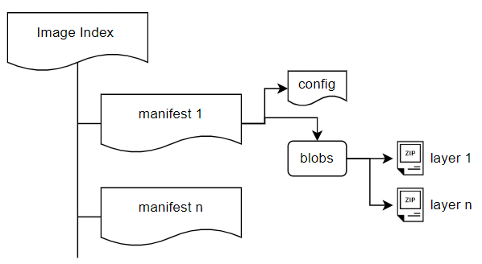

# Estructura de las imágenes OCI

Las imágenes se construyen a partir de **capas ordenadas**. 

## ¿Qué es una capa?

* Puedes pensar en una capa como un conjunto de cambios en el sistema de archivos. 
* En el proceso de creación de las imágenes, los comandos que cambian el sistema de archivos (instalaciones, modificación de ficheros, copiar ficheros,...) producen una nueva capa.
* Cada capa es sólo un conjunto de diferencias con respecto a la capa anterior.
* Cada capa se guarda en un directorio diferente.
* Cuando tomas todas las capas y las apilas, obtienes una nueva imagen que contiene todos los cambios acumulados.
* Si tienes muchas imágenes basadas en capas similares (capas que contienen sistemas operativos similares o ficheros comunes), entonces todas estas capas comunes serán almacenadas sólo una vez.

## Especificación de imagen OCI

Open Container Initiative (OCI) es la organización responsable de estandarizar las especificaciones referentes al trabajo con los contenedores. Una de las especificaciones que desarrolla es el **formato de imagen** (Open Container Initiative Image Format normalmente abreviado en OCI Image Format). Determina el formato para empaquetar la imagen del contenedor de software. Con esto conseguimos que distintas aplicaciones (motores de contenedores, registros de imágenes,...) puedan trabajar con el mismo formato de imágenes.

El formato de las imágenes Docker, llamado **Docker V2** difiere al formato de imágenes OCI, pero son totalmente compatibles.

## Almacenamiento de una imagen OCI en Podman

El driver de almacenamiento que se usa por defecto para gestionar el conjunto de capas que forman parte de una imagen en la versión actual de Podman es **overlay v2**.

El sistema de archivos de unión de superposición está presente en el núcleo de Linux desde la versión 3.18. Suele estar habilitado por defecto y se activa dinámicamente una vez que se inicia un montaje con este
sistema de archivos.

Este sistema de archivos permite que un árbol de directorios superponerse a otro, almacenando sólo las diferencias, pero mostrando el último árbol de directorios actualizado cómo si fuera un sólo conjunto de directorios.

El fichero de configuración de Podman donde se indica la configuración de almacenamiento es:

* Para contenedores rootful: `/usr/share/containers/storage.conf`.
* Para contenedores rootless creados por el usuario `usuario`: `/home/usuario/.config/containers/storage.conf`

Los parámetros más importantes de estos ficheros son `driver`, donde se indica el driver utilizado y `graphroot` donde se indica que el directorio de almacenamiento de las imágenes. Este directorio será el siguiente:

* Para contenedores rootful: `/var/lib/containers/storage`.
* Para contenedores rootless creados por el usuario `usuario`: `/home/usuario.local/share/containers/storage/`.

La información de la configuración de almacenamiento, la podemos ver ejecutando el siguiente comando para contenedores rootful:

```bash
$ sudo podman info|grep -A19 store
store:
  configFile: /usr/share/containers/storage.conf
  ...
  graphDriverName: overlay
  ...
  graphRoot: /var/lib/containers/storage
  ...
```

Y para contenedores rooless:

```bash
$ podman info|grep -A19 store
store:
  configFile: /home/usuario/.config/containers/storage.conf
  ...
  graphDriverName: overlay
  ...
  graphRoot: /home/usuario.local/share/containers/storage/
  ...
```

### Ejemplo de almacenamiento imagen

Para ver este ejemplo, vamos a descargar una imagen para crear un contenedor rootful y veremos la estructura de los directorios donde se almacena. en primer lugar descargamos una imagen:

```bash
$ sudo podman pull quay.io/centos7/httpd-24-centos7:latest
Trying to pull quay.io/centos7/httpd-24-centos7:latest...
Getting image source signatures
Copying blob 8f001c8d7e00 done   | 
Copying blob c61d16cfe03e done   | 
Copying blob 06c7e4737942 done   | 
Copying config d7af31210b done   | 
Writing manifest to image destination
d7af31210b288164c319bae740ca1281528390a3c5cee657e95f243670b49e6a
```

Como observamos esta imagen está formado por 3 capas (`Copying blob...`).

Veamos la estructura de directorio que tenemos en el directorio de almacenamiento, como `root`ejecutamos las siguientes instrucciones:

```bash
# cd /var/lib/containers/storage/
# ls
db.sql  defaultNetworkBackend  libpod  overlay  overlay-containers  overlay-images  overlay-layers  secrets  storage.lock  tmp  userns.lock  volumes
```

Los directorios que nos interesan son los siguientes:

* `overlay-images`: Contiene los metadatos de las imágenes descargadas.
* `overlay-layers`: Contiene los archivos de todas las capas de las imágenes que tenemos descargadas.
* `overlay`: Este es el directorio que contiene las capas descomprimidas de cada imagen.

Veamos el directorio `overlay-images`:

```
# cd overlay-images/
# ls
d7af31210b288164c319bae740ca1281528390a3c5cee657e95f243670b49e6a  images.json  images.lock
```

Como sólo tenemos una imagen descargada sólo tenemos un directorio cuyo nombre es el identificados de la imagen. En ese directorio encontramos el archivo de manifiesto que describe las capas que componen la imagen.En el fichero `images.json`encontramos un índice con las imágenes que tenemos descargas en nuestro registro local. Podemos usar la utilidad `jq` para visualizar de manera correcta el formato json del fichero:

```
# cat images.json | jq
```

Veamos el directorio `overlay-layers`:

```
# cd overlay-layers/
# ls
007d2037805f6ca87f969f06c81286a47d98664e3f62e5fd393ec3da08a55b3c.tar-split.gz  layers.json
53498d66ad83a29fcd7c7bcf4abbcc0def4fc912772aa8a4483b51e232309aee.tar-split.gz  layers.lock
8853b21ed9ab4ab7fd6c118f5b1c11e974caa7e133a99981573434d3b6018cf0.tar-split.gz
```

Como podemos ver, acabamos de encontrar todos los archivos de capas descargados de nuestra imagen. Además el fichero `layers.json` es un índice de todas las capas que tenemos descargadas.

Las capas que hemos visto anteriormente están descomprimidas en el directorio `overlay`:

```
# cd overlay
# ls
007d2037805f6ca87f969f06c81286a47d98664e3f62e5fd393ec3da08a55b3c  8853b21ed9ab4ab7fd6c118f5b1c11e974caa7e133a99981573434d3b6018cf0
53498d66ad83a29fcd7c7bcf4abbcc0def4fc912772aa8a4483b51e232309aee  l
```

En primer lugar tenemos un directorio por cada una de las capas descargadas, la estructura de este directorio es la siguiente:

```
# cd 007d2037805f6ca87f969f06c81286a47d98664e3f62e5fd393ec3da08a55b3c/
# ls
diff  link  lower  merged  work
```

Veamos que guardan cada uno de estos directorios y ficheros:

* `diff`: Este directorio representa la capa superior de la superposición, y se utiliza para almacenar
cualquier cambio en la capa.
* `lower`: Este archivo informa de todos los montajes de las capas inferiores, ordenados de mayor a menor.
* `merged`: En este directorio se monta el sistema de fichero superpuesto.
* `work`: Este directorio se utiliza para operaciones internas.
* `link`: Este archivo contiene una cadena única para la capa.

En el directorio `overlay` también encontramos un directorio `l`. En este directorio hay enlaces simbólicos con cadenas únicas que apuntan al directorio `diff` para cada capa. Los enlaces simbólicos hacen referencia a capas inferiores (las cadenas únicas indicadas en el fichero `link` de cada capa).

```
# cd overlay/l
# ls -al
total 12
drwxr-xr-x. 1 root root 156 Mar 21 07:45 .
drwx------. 1 root root 422 Mar 21 07:45 ..
lrwxrwxrwx. 1 root root  72 Mar 21 07:38 IVBKXQVXCMS3S4MYZYTY4NQ3W5 -> ../007d2037805f6ca87f969f06c81286a47d98664e3f62e5fd393ec3da08a55b3c/diff
lrwxrwxrwx. 1 root root  72 Mar 21 07:38 LCIWXBIPSMIGB2RTQV36QKTCRH -> ../53498d66ad83a29fcd7c7bcf4abbcc0def4fc912772aa8a4483b51e232309aee/diff
lrwxrwxrwx. 1 root root  72 Mar 21 07:39 ZXSJGMR5T7VDVVGRWHG3E2I6DZ -> ../8853b21ed9ab4ab7fd6c118f5b1c11e974caa7e133a99981573434d3b6018cf0/diff
```

Volvamos a ver el manifiesto de la imagen con la que estamos trabajando:

```
# cd overlay-images/d7af31210b288164c319bae740ca1281528390a3c5cee657e95f243670b49e6a/
# cat manifest | jq
{
  "schemaVersion": 2,
  "mediaType": "application/vnd.docker.distribution.manifest.v2+json",
  "config": {
    "mediaType": "application/vnd.docker.container.image.v1+json",
    "size": 15278,
    "digest": "sha256:d7af31210b288164c319bae740ca1281528390a3c5cee657e95f243670b49e6a"
  },
  "layers": [
    {
      "mediaType": "application/vnd.docker.image.rootfs.diff.tar.gzip",
      "size": 78951426,
      "digest": "sha256:c61d16cfe03e7bfb4e7e312f09fb17a815be72096544133320058ee6ce55d0b2"
    },
    {
      "mediaType": "application/vnd.docker.image.rootfs.diff.tar.gzip",
      "size": 10435798,
      "digest": "sha256:06c7e47379429b2a921140524d1596e2c2bf8bc7b29fa9df0ee73c91f5b4c24f"
    },
    {
      "mediaType": "application/vnd.docker.image.rootfs.diff.tar.gzip",
      "size": 50603928,
      "digest": "sha256:8f001c8d7e009adf9e088ff8b85806da558aa713eb545d2af045943eed1ad66a"
    }
  ]
}
```

Encontramos que nuestra imagen está formada por 3 capas, de cada capa tenemos un hash que la identifica la capa descargada comprimida. 

A continuación, debemos comparar el hash de cada capa con la lista de todas las capas que hemos descargado:

```
# cd overlay-layers/
# cat layers.json | jq
[
  {
    "id": "53498d66ad83a29fcd7c7bcf4abbcc0def4fc912772aa8a4483b51e232309aee",
    "created": "2024-03-21T07:38:50.395783286Z",
    "compressed-diff-digest": "sha256:c61d16cfe03e7bfb4e7e312f09fb17a815be72096544133320058ee6ce55d0b2",
    "compressed-size": 78951426,
    "diff-digest": "sha256:53498d66ad83a29fcd7c7bcf4abbcc0def4fc912772aa8a4483b51e232309aee",
    "diff-size": 211829760,
    "compression": 2,
    ...
```

Haciendo la comprobación de hash encontramos el identificados de nuestra primera capa, y podemos acceder a su contenido:

```
# cd overlay/53498d66ad83a29fcd7c7bcf4abbcc0def4fc912772aa8a4483b51e232309aee
# ls
diff  empty  link  merged  work
```

Como podemos comprobar, no hay ningún archivo `lower` dentro del directorio de la capa porque esta es la
primera capa de nuestra imagen. La diferencia que podemos notar es la presencia de un directorio llamado `empty`. Esto se debe a que si una capa no tiene padre, el sistema de superposición creará un directorio vacío.

Finalmente, vamos a crear un contenedor, y veremos que se crea la capa del contenedor de lectura y escritura. Esta nueva capa  capa contendrá sólo las diferencias entre las inferiores. Para ello, ejecutamos:
 
```bash
$ sudo podman run -d quay.io/centos7/httpd-24-centos7
ae697efd8d29d8d75988390c19cf787ed8057bacfb1cea82a93a2c36756f88ee
```

Y vamos a crear un fichero en el nuevo contenedor:

```bash
$ sudo podman exec ae697efd8d29d8d75988390c19cf787ed8057bacfb1cea82a93a2c36756f88ee bash -c "echo 'Ejemplo Podman' > /tmp/tmpfile.txt"
```

En el directorio de almacenamiento tenemos un directorio llamado `overlay-containers` donde encontramos la información de almaceanmiento de los contenedores que hemos creado:

```
cd overlay-containers/
# ls
ae697efd8d29d8d75988390c19cf787ed8057bacfb1cea82a93a2c36756f88ee  containers.json  containers.lock
```

El directorio que tiene como nombre el identificador del contenedor que hemos creado tiene información del contenedor, y en el fichero `containers.json` tenemos un índice de los contenedores que hemos creado:

```
# cat containers.json | jq
[
  {
    "id": "ae697efd8d29d8d75988390c19cf787ed8057bacfb1cea82a93a2c36756f88ee",
    "names": [
      "stoic_cerf"
    ],
    "image": "d7af31210b288164c319bae740ca1281528390a3c5cee657e95f243670b49e6a",
    "layer": "206efdc36850d2f4d47776ef079828b712e07be796209122ba988df4a3e1362b",
    "metadata": "{\"image-name\":\"quay.io/centos7/httpd-24-centos7:latest\",\"image-id\":\"d7af31210b288164c319bae740ca1281528390a3c5cee657e95f243670b49e6a\",\"name\":\"stoic_cerf\",\"created-at\":1711009710}",
    "created": "2024-03-21T08:28:30.380877163Z",
    "flags": {
      "MountLabel": "system_u:object_r:container_file_t:s0:c186,c931",
      "ProcessLabel": "system_u:system_r:container_t:s0:c186,c931"
    }
  }
]
```
En el campo `layer` tenemos el identificador de la capa del contenedor, donde se irán escribiendo las diferencias de los ficheros del contenedor respectos a las capas inferiores correspondientes a la imagen. Por lo tanto podemos ver los ficheros que hemos escrito en esta capa:

```
# cd overlay/206efdc36850d2f4d47776ef079828b712e07be796209122ba988df4a3e1362b/diff/tmp/
# ls
tmpfile.txt
```

## Estructura de una imagen OCI

Una imagen OCI está formado por los siguientes elementos:



* **

## ¿Qué ocurre cuando creamos un contenedor?


* Cuando se crea un nuevo contenedor desde una imagen, su sistema de archivos será la unión de todas las capas de la imagen. 
* Las capas de la imagen son únicamente de lectura, por lo que se añade una nueva capa de lectura-escritura. 
* Todos los cambios efectuados al contenedor específico son almacenados en esa capa.
* Esta capa se suele llamar **Capa del Contenedor**.
* Los contenedores son efímeros, por que cuando lo borramos, se borra la capa del contenedor, por lo que se pierde todos sus datos.
* Por lo tanto cuando creamos un contenedor, el almacenamiento en disco es muy pequeño, ya que las capas de la imagen desde las que se ha creado se comparten con el contenedor y la capa del contenedor en un primer momento tiene muy pocos ficheros.
* Si tenemos un contenedor creado a partir de una imagen, **esta imagen no se puede borrar** ya que sus capas forman parte del sistema de archivos del contenedor en ejecución.


