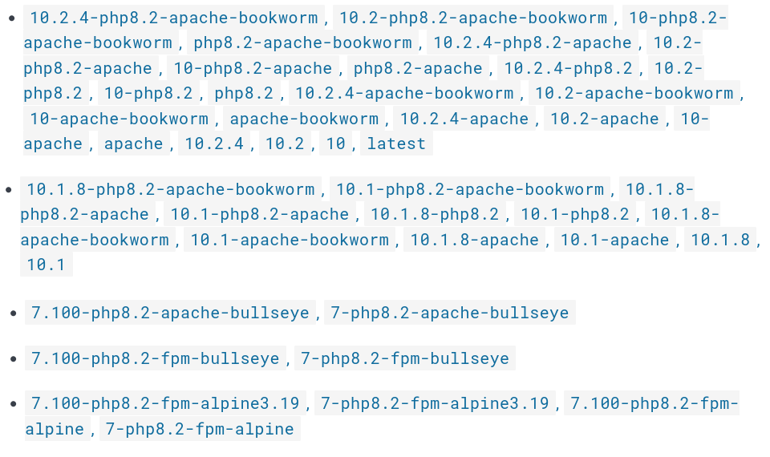

# Imágenes de contenedor

## ¿Qué es una imagen?

* Una imagen es una plantilla de sólo lectura con instrucciones para crear un contenedor. 
* Contiene el sistema de fichero que tendrá el contenedor. 
* Además establece el comando que ejecutará el contenedor por defecto. 
* Podemos crear nuestras propias imágenes o utilizar las creadas por otros y publicadas en un registro. 
* Un contenedor es una instancia ejecutable de una imagen. 
* Con Podman, Buildah y Skopeo trabajamos con imágenes OCI, cuyo formato difieren de las imágenes de Docker, aunque son totalmente compatibles.

## Registro de imágenes

* Un *Registro de Imágenes* es un componente donde se almacena las imágenes.
* Tenemos un **registro local** donde se almacenan las imágenes desde las que vamos a crear contenedores. 
* Existen **registros remotos** que nos permiten distribuir las imágenes.
* Los registros pueden ser **públicos o privados**. 
* Podman, buildah y Skopeo pueden gestionar y trabajar con distintos registros:
   * `docker.io`: El es registro público de Docker, llamado Docker Hub.
   * `quay.io`: Es un registro público de imágenes proporcionado por Red Hat.
   * `registry.access.redhat.com`: Es otro registro ofrecido por Red Hat, que ofrece imágenes de contenedores certificadas y soportadas por Red Hat Enterprise Linux (RHEL), OpenShift y otras tecnologías relacionadas con Red Hat.
   * `registry.fedoraproject.org`: Es un registro de imágenes de contenedores mantenido por el Proyecto Fedora. Contiene imágenes de contenedores basadas en Fedora y otras tecnologías relacionadas con Fedora.
   * Amazon Elastic Container Registry (ECR)
   * Google Container Registry (GCR)
   * Azure Container Registry (ACR)
   * GitLab Container Registry

## Nombre de las imágenes

El nombre de una imagen suele estar formado por varios elementos:

* **Nombre del registro**.
* **Nombre de la imagen**: Si la imagen no es oficial se le antepone el **nombre del usuario**. Cuando la imagen es oficial, según el repositorio, existen nombres de usuario especiales. Por ejemplo en `docker.io` las imágenes oficiales pertenecen a un usuario especial llamado **library**, y podemos no indicarlo.
* **Nombre de la etiqueta**: Una misma imagen suele tener varias etiquetas, que nos permiten el versionado de la misma. De esta manera controlamos los cambios que se van produciendo en ella. Si no indicamos etiqueta, por defecto se usa la etiqueta **latest**, por lo que la mayoría de las imágenes tienen una versión con este nombre.

Ejemplos de nombres de imágenes:

* `docker.io/library/debian`
* `docker.io/debian:bookworm`
* `docker.io/josedom24/test_web:v1`
* `quay.io/libpod/banner`
* `registry.access.redhat.com/ubi8`

## Ejemplo de etiquetas para la imagen Drupal

[**Drupal**](https://www.drupal.org/) es una aplicación web escrita en PHP que nos permite construir un CMS. Si estudiamos la [documentación](https://hub.docker.com/_/drupal) de la imagen `drupal`, que encontramos en Docker Hub, podemos ver algunas de las etiquetas disponibles para la imagen que corresponden a versiones distintas de la aplicación. En marzo de 2024 serían las siguientes:

Cada imagen está identificada por un **identificador**. Una misma imagen, puede estar etiquetada por etiquetas diferentes.

Por ejemplo, en la imagen `drupal`, tenemos para una misma versión varias etiquetas: `10.2.4`, `10.2`, `10`, `latest`,... apuntan a la misma versión de la imagen.

## La etiqueta latest

Si utilizamos el nombre de una imagen sin indicar la etiqueta, se toma por defecto la etiqueta **latest** que suele corresponder a la última versión de la aplicación. En el caso concreto de la imagen `drupal`, observamos que la etiqueta `latest` corresponde a la última versión la `10.2.4`. 

## ¿Para que sirvan las etiquetas de las imágenes?

* Normalmente las etiquetas nos permiten **versionar** las imágenes. 
* Podemos seguir observando que algunas etiquetas, nos indican además de la versión, los **servicios que tienen instalada** la imagen, por ejemplo si usamos la etiqueta `10.2.4-php8.2-fpm-bookworm` estaremos creando un contenedor con la ultima versión de la aplicación pero que además tendrá un servidor de aplicaciones php-fpm para servir la aplicación.
* Otro ejemplo: si usamos la etiqueta `10.2.4-php8.2-fpm-alpine3.19`, además de la última versión y que tiene instalado php-fpm, nos indica que **la imagen base** que se ha usado para crear la imagen es una distribución `alpine` que se caracteriza por ser una distribución muy liviana.

## Tipos de imágenes

Podemos tener varios tipos de imágenes, según lo que nos ofrece:

* Imágenes que nos ofrecen una **distribución completa de un sistema operativo** (Ubuntu, CentOs, Debian, Fedora, Alpine,...). La distribución **alpine** nos ofrece un sistema operativo que sólo incluyen los elementos esenciales necesarios para ejecutar una aplicación, por este motivo ocupa muy poco espacio, por lo tanto sus imágenes son muy pequeñas. Además, nos podemos encontrar imágenes de este tipo con la etiqueta **slim**, en este caso serán imágenes más livianas.
    * Ejemplo: **debian:bookworm**, **debian:bookworm-slim**, **ubuntu:22.04**, **alpine:3**.
* Imágenes que nos ofrecen distintos **servicios** (servidor web, servidor de base de datos,...). En este caso las etiquetas suelen indicar la versión y el sistema operativo base que ofrece el servicio.
    * Ejemplo: **http:2.4-bookworm**, **http:2.4-alpine**, **mariadb:11.2-jammy**, **mariadb:10.6-focal**.
* Imágenes que ofrecen **lenguajes de programación** (PHP, Python, Java, NodeJS,...). En este caso la etiqueta nos puede indicar la versión, el sistema operativo base que se utiliza, el servicio que se está ofreciendo.
    * Ejemplo: **php:bookworm**, **php:fpm-bookworm**, **python:3.12-slim-bookworm**, **openjdk:23-ea-6-jdk-bookworm**.
* Imágenes que ofrecen un CMS completo (WordPress, NextCloud, Drupal,...). Como en el caso anterior, las etiquetas nos informan de la versión, del sistema operativo, del servicio ofrecido,...
    * Ejemplos: **wordpress:6.4.2-php8.1-apache**, **wordpress:6.4.2-php8.1-fpm**, **wordpress:6.4.2-fpm-alpine**.