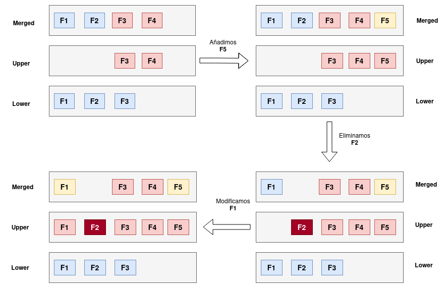

# Introducción a los sistemas de archivos de unión

Un **Sistema de Archivos Unión (UnionFS)** en Linux nos permite fusionar el contenido de uno o varios sistemas de archivos (directorios) mientras se mantiene el contenido físicamente separado. 

Existen varios sistemas de archivos que me permiten crear un sistema de archivos de unión, por ejemplo OverlayFS, AUFS, btrfs, UnionFS, ...

En este ejemplo, vamos a usar el sistema **OverlayFS**, que nos permite superponer arboles de directorios, almacenando sólo las diferencias, pero mostrando el último árbol de directorios actualizado cómo si fuera un sólo conjunto de directorios. Este sistema de archivo está incluido en el kernel de Linux y se activa de forma dinámica una vez que se inicia un montaje con este sistema de archivos.

Cada árbol de directorio forma lo que denominamos una **capa**. En el siguiente ejemplo vamos a crear un sistema de archivos a partir de la unión de dos capas: la capa **lower** (guardada en un directorio llama do `lower`) que puede ser lectura y escritura, pero que en nuestro ejemplo la vamos a tratar cómo de **sólo lectura** y una capa superior llamada **upper**, de **lectura y escritura** y que contiene las diferencias necesarias para crear el sistema de archivo de unión , que estará guardado en el directorio **merge**.



1. Partimos de la unión de la capa **lower** con la cap **upper** obteniendo un sistema de archivos de unión **merged**. Como vemos en el sistema de archivos de unión encontramos el fichero **F3** que era diferente en la capa **upper**.
2. Si en sistema de archivos de unión **merged** creamos un nuevo fichero **F5** se guardará en la capa superior **upper**.
3. Si eliminamos el fichero **F2** del sistema de archivos de unión **merged**, esa diferencia se guardaría en la capa superior **upper**.
4. Si modificamos el fichero **F1** del sistema de archivos de unión **merged**, esa diferencia se guardará en la cpa **upper** pero evidentemente no se modificará la capa **lower**.


Veamos un ejemplo. Vamos a crear la estructura de directorios y vamos a crear los ficheros dentro de cada capa:

```bash
$ mkdir lower upper merged work
$ echo "Fichero 1 en la capa lower" > lower/f1
$ echo "Fichero 2 en la capa lower" > lower/f2
$ echo "Fichero 3 en la capa lower" > lower/f3
$ echo "Fichero 3 en la capa upper" > upper/f3
$ echo "Fichero 4 en la capa upper" > upper/f4
```

A continuación podemos montar el sistema de archivo de unión ejecutando la siguiente instrucción:

```bash
$ sudo mount overlay -t overlay -o lowerdir=lower,upperdir=upper,workdir=work merged
```

El directorio de trabajo (`workdir`) necesita ser un directorio vacío dentro del mismo sistema de archivos en el que está montado el directorio superior (`upper`).

Ahora podemos ver el contenido del sistema de archivos de unión:

```bash
$ ls -al merged/
total 16
drwxr-xr-x. 1 fedora fedora   8 Mar 22 08:13 .
drwx------. 1 fedora fedora 274 Mar 22 08:13 ..
-rw-r--r--. 1 fedora fedora  27 Mar 22 08:13 f1
-rw-r--r--. 1 fedora fedora  27 Mar 22 08:13 f2
-rw-r--r--. 1 fedora fedora  27 Mar 22 08:13 f3
-rw-r--r--. 1 fedora fedora  27 Mar 22 08:13 f4
```

Ahora podemos añadir un fichero al sistema de archivos de unión, y veremos que se guarda en la capa superior de lectura y escritura:

```bash
$ echo "Fichero 5 en merged" > merged/f5

$ ls -al merged/
total 20
drwxr-xr-x. 1 fedora fedora  12 Mar 22 08:17 .
drwx------. 1 fedora fedora 274 Mar 22 08:13 ..
-rw-r--r--. 1 fedora fedora  27 Mar 22 08:13 f1
-rw-r--r--. 1 fedora fedora  27 Mar 22 08:13 f2
-rw-r--r--. 1 fedora fedora  27 Mar 22 08:13 f3
-rw-r--r--. 1 fedora fedora  27 Mar 22 08:13 f4
-rw-r--r--. 1 fedora fedora  20 Mar 22 08:17 f5

ls -al upper/
total 12
drwxr-xr-x. 1 fedora fedora  12 Mar 22 08:17 .
drwx------. 1 fedora fedora 274 Mar 22 08:13 ..
-rw-r--r--. 1 fedora fedora  27 Mar 22 08:13 f3
-rw-r--r--. 1 fedora fedora  27 Mar 22 08:13 f4
-rw-r--r--. 1 fedora fedora  20 Mar 22 08:17 f5
```

Al eliminar un fichero en el sistema de archivos de unión, y veremos que se deja indicado en la capa superior:

```bash
$ rm merged/f2

$ ls -al merged/
total 16
drwxr-xr-x. 1 fedora fedora  16 Mar 22 08:20 .
drwx------. 1 fedora fedora 274 Mar 22 08:13 ..
-rw-r--r--. 1 fedora fedora  27 Mar 22 08:13 f1
-rw-r--r--. 1 fedora fedora  27 Mar 22 08:13 f3
-rw-r--r--. 1 fedora fedora  27 Mar 22 08:13 f4
-rw-r--r--. 1 fedora fedora  20 Mar 22 08:17 f5

$ ls -al upper/
total 12
drwxr-xr-x. 1 fedora fedora   16 Mar 22 08:20 .
drwx------. 1 fedora fedora  274 Mar 22 08:13 ..
c---------. 2 root   root   0, 0 Mar 22 08:20 f2
-rw-r--r--. 1 fedora fedora   27 Mar 22 08:13 f3
-rw-r--r--. 1 fedora fedora   27 Mar 22 08:13 f4
-rw-r--r--. 1 fedora fedora   20 Mar 22 08:17 f5
```

Y por último, si modificamos un fichero en el sistema de archivos de unión, dicha modificación quedará reflejada en la capa superior, pero no en la capa inferior:

```bash
$ echo "Modifico fichero 1" > merged/f1

$ cat merged/f1
Modifico fichero 1

$ cat upper/f1
Modifico fichero 1

$ cat lower/f1
Fichero 1 en la capa lower
```

Para terminar indicar que la capa inferior `lowerdir` de sólo lectura se puede construir a partir de la unión de varias capas:

```bash
$ mount -t overlay overlay -o lowerdir=lower1:lower2:lower3,upperdir=upper,workdir=work merged
```