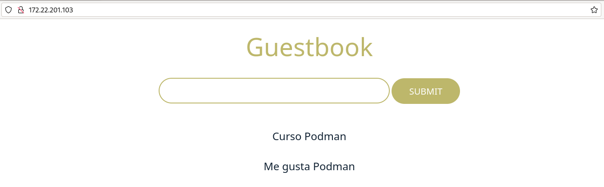
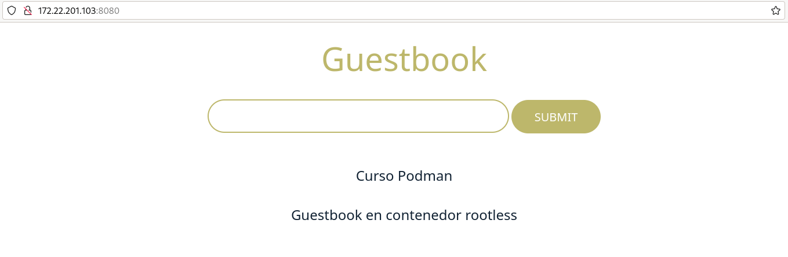

# Despliegue de la aplicación Guestbook

En este ejemplo vamos a desplegar una aplicación web que requiere de dos servicios (servicio web y servicio de base de datos) para su ejecución. La aplicación se llama Guestbook y necesita los dos siguientes servicios:

* La **aplicación Guestbook** es una aplicación web desarrollada en Python que es servida en el **puerto 5000/tcp**. Utilizaremos la imagen `iesgn/guestbook` para crear el contenedor.
* Esta aplicación guarda la información en una **base de datos no relacional redis**, que utiliza el **puerto 6379/tcp** para conectarnos. Usaremos la imagen `redis` para la creación del contenedor.

Podemos configurar el contenedor el contenedor que sirve la aplicación Guestbook usando la variable de entorno `REDIS_SERVER` para indicar el nombre del servidor de base al que conecta. Su valor por defectos es `redis`, si nombramos el contenedor redis con ese nombre no hará falta indicar la variable de entorno.

## Despliegue con contenedores rootful

Los dos contenedores tienen que estar conectados en la misma red bridge definida por el usuario y deben tener acceso por nombres (resolución DNS) ya que de principio no sabemos que dirección IP va a tomar cada contenedor. Por lo tanto vamos a crear los contenedores en la misma red:

```
$ sudo podman network create red_guestbook
```

Para ejecutar los contenedores:

```
$ mkdir redis
$ sudo podman run -d --name contenedor_redis --network red_guestbook -v ./redis:/data:Z docker.io/redis redis-server --appendonly yes
$ sudo podman run -d -p 80:5000 -e REDIS_SERVER=contenedor_redis --name guestbook --network red_guestbook docker.io/iesgn/guestbook
```

Algunas observaciones:

* No es necesario mapear el puerto del contenedor de la base de datos redis, ya que no vamos a acceder desde el exterior. Sin embargo la aplicación Guestbook va a poder acceder a la base de datos porque están conectado a la misma red.
* Al nombrar al contenedor de la base de datos con `contenedor-redis` se crea una entrada en el DNS que resuelve ese nombre con la dirección IP del contenedor. Como hemos indicado, con la variable `REDIS_SERVER` indicamos a la aplicación Guestbook usa ese nombre para acceder.
* Para conseguir la persistencia de datos en el contenedor de la base de datos redis, montamos un bind mount (también podríamos haber usado un volumen) en el directorio `/data` del contenedor, con la opción `Z` para configurar de manera adecuada SELinux. Además ejecutamos el comando `redis-server --appendonly yes` para que se guarden los datos de la base de datos en ese directorio.

Podemos acceder a la aplicación para comprobar su funcionamiento:



## Despliegue con contenedores rootful

En este caso el contenedor guestbook conectará al contenedor redis usando la dirección IP del host. Por lo tanto tenemos que tener en cuenta los siguiente:

* En este ejemplo la dirección IP del host es `10.0.0.231`.
* El valor de la variable de configuración `REDIS_SERVER` para configurar la aplicación Guestbook para indicarle donde tiene que conectar a la base de datos debe valer la dirección IP del host.
* En los dos contenedor debemos mapear el puerto: en el contenedor `guestbook` porque vamos acceder desde el exterior (recordando que no podemos usar puertos privilegiados), y en el contenedor `redis` porque se va a acceder desde el otro contenedor.
* En este ejemplo hemos usado un volumen.

Por lo tanto los comandos que debemos ejecutar son:

```
$ podman run -d -p 6379:6379 --name redis -v vol_redis:/data docker.io/redis redis-server --appendonly yes
$ podman run -d -p 8080:5000 -e REDIS_SERVER=10.0.0.231 --name guestbook docker.io/iesgn/guestbook
```

Y podemos acceder a la aplicación para comprobar su funcionamiento:

