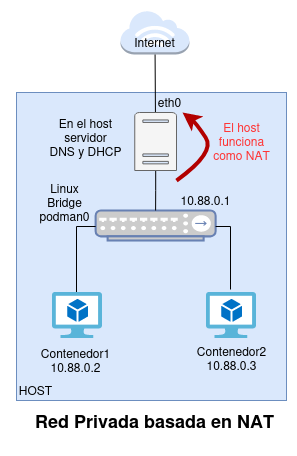
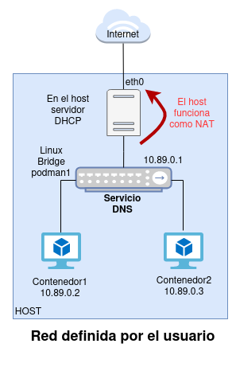
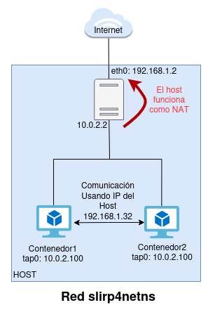

# Redes en Podman

Dependiendo del tipo de contenedor que creemos, Podman utilizará distintos mecanismos para ofrecer conectividad al contenedor:

* **Contenedores rootful**: Podman 4.0 utiliza un driver de red llamado [netavark](https://github.com/containers/netavark) para ofrecer a los contenedores una dirección IP enrutable. El driver netavark sigue las especificaciones establecidas por el proyecto [CNI](https://www.cni.dev/) (Container Network Interface) que estandariza los medios de comunicación de red que utilizan los contenedores OCI.
* **Contenedores rootless**: Cuando usamos contenedores rootless, tenemos una limitación debida a que los usuarios sin privilegios no pueden crear interfaces de red en el host. En este caso se utiliza, por defecto el proyecto [slirp4netns](https://github.com/rootless-containers/slirp4netns) que nos proporciona conectividad a los contenedores pero sin ofrecerles una dirección IP enrutable. En la nueva versión de Podman, la 5.0 este proyecto se ha sustituido por otro proyecto con las mismas características llamado [pasta](https://passt.top/passt/about/).

## Tipos de redes en Podman

* **Red Brige**: Es escenario más común cuando trabajamos con contenedores rootful. Nos permite que los contenedores estén conectados a una red privada, con un direccionamiento privado conectado al host mediante un Linux Bridge. 
    * Nos permiten aislar los contenedores del acceso exterior.
    * Los contenedores conectados a un red **bridge** tienen acceso a internet por medio de una regla SNAT. 
    * Usamos el parámetro `-p` en `podman run` para exponer algún puerto. Se crea una regla DNAT para tener acceso al puerto.
* **Red Host**:  La pila de red de ese contenedor no está aislada del host, es decir, el contenedor no tiene asignada su propia dirección IP. Por ejemplo, si ejecutas un contenedor que ofrece su servicio en al puerto 80/tcp y utilizas el modo de red host, la aplicación del contenedor estará disponible en el puerto 80/tcp de la dirección IP del host.
* **Redes macvlan o ipvlan**: Son configuraciones más avanzadas de red, donde se permite que el contenedor esté conectado directamente a la red donde está conectado el host. La diferencia entre las dos, es que mientras macvlan permite la comunicación entre contenedores, ipvlan aísla completamente a cada contenedor.
* **Red slirp4netns**: Es una configuración de red con capacidades limitadas pero puede ser utilizada con los contenedores rootless. Crea un túnel desde el host al contenedor para reenviar el tráfico.

## Redes bridge

Existen dos tipos de redes bridge:

* La red **bridge** creada por defecto por Podman para que de forma predeterminada los contenedores tengan conectividad.
* Y las **redes bridge definidas por el usuario**.

### Red bridge por defecto

* Es creada durante la instalación de Podman.
    ```
    $ sudo podman network ls
    NETWORK ID    NAME        DRIVER
    2f259bab93aa  podman      bridge
    ```
* Por defecto los contenedores que creamos se conectan a la red de tipo bridge llamada **podman**.
* Se crea en el host un *Linux Bridge* llamado **podman0**.
* El direccionamiento de esta red es 10.88.0.0/16.
* Por compatibilidad con las red por defecto que crea Docker, esta red no tiene un servidor DNS activo.



### Red bridge definida por el usuario

* Nos permiten aislar los distintos contenedores que tengo en distintas redes privadas, de tal manera que desde cada una de las redes solo podamos acceder a los equipos de esa misma red.
* Nos proporcionan **resolución DNS** entre los contenedores, por lo que los contenedores pueden conectar a otros contenedores usando su nombre.
* Me permiten **gestionar de manera más segura el aislamiento de los contenedores**, ya que si no indico una red al arrancar un contenedor éste se incluye en la red por defecto donde pueden convivir servicios que no tengan nada que ver.
* Nos proporcionan **más control sobre la configuración de las redes**. Los contenedores de la red por defecto comparten todos la misma configuración de red (MTU, reglas de cortafuegos, etc...).
* Es importante que nuestros contenedores en producción se ejecuten conectados a una red bridge definida por el usuario.



## Red slirp4netns

* Es el mecanismo de red usado en los contenedores rootless, ya que los usuarios sin privilegios no pueden crear interfaces de red en el host.
* Crea un entorno de red aislado para el contenedor y utilizando el módulo `slirp` del kernel para realizar la traducción de direcciones de red (NAT), lo que permite que el contenedor acceda a internet a través de la conexión de red del host.
* Crea un dispositivo TAP en el espacio de nombres de red del contenedor y se conecta a la pila TCP/IP en modo usuario. 
* Al utilizar este tipo de red, el usuario sin privilegios tendrá que usar puertos no privilegiados, mayores que el 1024.
* Uno de los inconvenientes de slirp4netns es que los contenedores están completamente aislados unos de otros, por lo que tendrán que utilizar los puertos expuestos para comunicarse.

