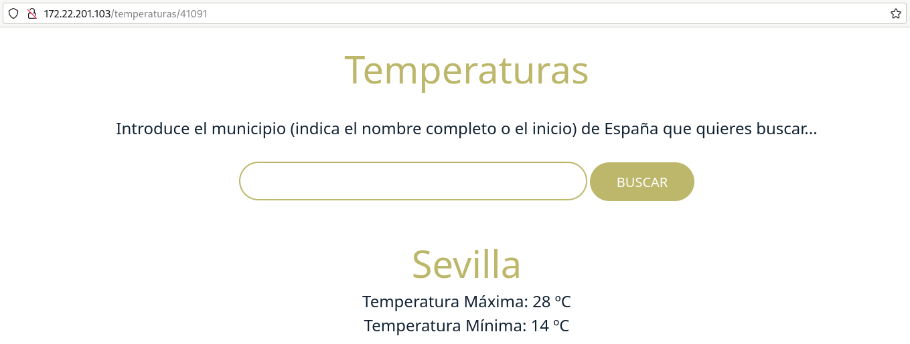

# Despliegue de la aplicación Temperaturas

Vamos a hacer un despliegue completo de una aplicación llamada Temperaturas. Esta aplicación nos permite consultar la temperatura mínima y máxima de todos los municipios de España. Esta aplicación está formada por dos **microservicios**:

* `frontend`: Es una **aplicación escrita en Python** que nos ofrece una página web para hacer las búsquedas y visualizar los resultados. Este microservicio hará peticiones HTTP al segundo microservicio para obtener la información. Este microservicio ofrece el servicio en el puerto **3000/tcp**. Usaremos la imagen `iesgn/temperaturas_frontend` para la creación del contenedor.
* `backend`: Es el segundo microservicio que nos ofrece un **servicio web de tipo API Restful**. A esta API Web podemos hacerles consultas sobre los municipios y sobre las temperaturas. En este caso, se utiliza el puerto **5000/tcp** para ofrecer el servicio. Usaremos la imagen `iesgn/temperaturas_backend` para la creación del contenedor.

El microservicio `frontend` utiliza la variable `TEMP_SERVER` para configurar el nombre del servidor y el puerto de acceso que utiliza el microservicio `frontend` para acceder al microservicio `backend`. Su valor por defecto es `temperaturas-backend:5000`, si nombramos el contenedor `backend` con ese nombre no hará falta indicar la variable de entorno. 

## Despliegue con contenedores rootful

Los dos contenedores tienen que estar conectados en la misma red bridge definida por el usuario y deben tener acceso por nombres (resolución DNS) ya que de principio no sabemos que dirección IP va a tomar cada contenedor. Por lo tanto vamos a crear los contenedores en la misma red:

```
$ sudo podman network create red_temperaturas
```

Para crear los contenedores, ejecutamos:

```
$ sudo podman run -d --name backend --network red_temperaturas docker.io/iesgn/temperaturas_backend
$ sudo podman run -d -p 80:3000 -e TEMP_SERVER=backend:5000 --name frontend --network red_temperaturas docker.io/iesgn/temperaturas_frontend
```

Algunas observaciones:

* Este es un tipo de aplicación, que se caracteriza por **no necesitar guardar información** para su funcionamiento. Son las denominadas **aplicaciones sin estado**, por lo tanto no necesitamos almacenamiento adicional para la aplicación.
* No es necesario mapear el puerto de `backend`, ya que no vamos a acceder desde el exterior. Sin embargo el microservicio `frontend` va a poder acceder a `backend` al puerto 5000/tcp porque están conectado a la misma red.
* Como hemos indicado con la variable de entorno `TEMP_SERVER` configuramos el `frontend` para que conecte con el `backend`. Su valor es el nombre del contenedor `backend`.



## Despliegue con contenedores rootless

En este caso el contenedor `frontend` conectará al contenedor `backend` usando la dirección IP del host. Por lo tanto tenemos que tener en cuenta los siguiente:

* En este ejemplo la dirección IP del host es `10.0.0.231`.
* El valor de la variable de configuración `TEMP_SERVER` para configurar el microservicio `frontend` para indicarle donde tiene que conectar al microservicio `backend` debe valer la dirección IP del host y el puerto 5000/tcp.
* En los dos contenedor debemos mapear el puerto: en el contenedor `frontend` porque vamos acceder desde el exterior (recordando que no podemos usar puertos privilegiados), y en el contenedor `backend` porque se va a acceder desde el otro contenedor.

Por lo tanto los comandos que debemos ejecutar son:

```
$ podman run -d -p 5000:5000 --name backend  docker.io/iesgn/temperaturas_backend
$ podman run -d -p 8080:3000 -e TEMP_SERVER=10.0.0.231:5000 --name frontend  docker.io/iesgn/temperaturas_frontend
```

Y podemos acceder a la aplicación para comprobar su funcionamiento:


```