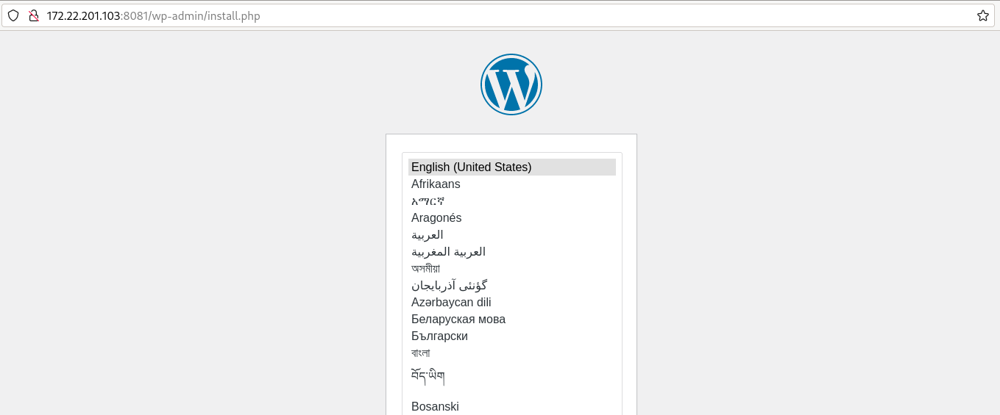

# Ejemplo: Despliegue de WordPress + MariaDB con systemd y Quadlet

Para poder desplegar WordPress + MariaDB necesitamos guardar las siguientes plantillas de unidades de sistemas en el directorio `/etc/containers/systemd`:

En primer lugar, definimos la red con la que vamos a trabajar en plantilla de unidad de Systemd `wordpress.network`:

```
[Network]
NetworkName=red-wordpress
```

También definimos los volúmenes que vamos a necesitar. En el fichero `wordpress.volume`:

```
[Volume]
VolumeName=wpvol
```

Y en el fichero `wordpress_mariadb.volume`:

```
[Volume]
VolumeName=dbvol
```

A continuación definimos los contenedores. En el fichero `wordpress.container` definimos el contenedor de WordPress:

```
[Unit]
Description=Un contenedor con WordPress

[Container]
Image=docker.io/wordpress
ContainerName=wordpress
PublishPort=8081:80
Network=wordpress.network
Volume=wordpress.volume:/var/www/html
Environment=WORDPRESS_DB_HOST=db
Environment=WORDPRESS_DB_USER=wordpress
Environment=WORDPRESS_DB_NAME=wordpress
Environment=WORDPRESS_DB_PASSWORD=wordpress

[Service]
Restart=always
TimeoutStartSec=900

[Install]
WantedBy=multi-user.target default.target
```
Y en el fichero `wordpress_mariadb.container` definimos el contenedor de MariaDB:

```
[Unit]
Description=Un contenedor con el servidor de base de datos MariaDB para Wordpress

[Container]
Image=docker.io/mariadb:10.5
ContainerName=db
Volume=wordpress_mariadb.volume:/usr/lib/mysql
Network=wordpress.network
Environment=MARIADB_ROOT_PASSWORD=my-secret-pw
Environment=MARIADB_USER=wordpress
Environment=MARIADB_DATABASE=wordpress
Environment=MARIADB_PASSWORD=wordpress

[Service]
Restart=always
TimeoutStartSec=900

[Install]
WantedBy=multi-user.target default.target
```

Ya podemos iniciar los servicios:

```
$ sudo systemctl daemon-reload
$ sudo systemctl start wordpress_mariadb
$ sudo systemctl start wordpress
```

Podemos comprobar los recursos que hemos creado:

```
$ sudo podman ps
CONTAINER ID  IMAGE                               COMMAND               CREATED             STATUS             PORTS                 NAMES
9800047ac022  docker.io/library/mariadb:10.5      mysqld                About a minute ago  Up About a minute                        db
eac1c9c70f7d  docker.io/library/wordpress:latest  apache2-foregroun...  11 seconds ago      Up 11 seconds      0.0.0.0:8081->80/tcp  wordpress

$ sudo podman network ls
NETWORK ID    NAME           DRIVER
b53cd35e30fd  red-wordpress  bridge

$ sudo podman volume ls
DRIVER      VOLUME NAME
local       dbvol
local       wpvol
```

Y podemos acceder a la aplicación para comprobar que está funcionando:

