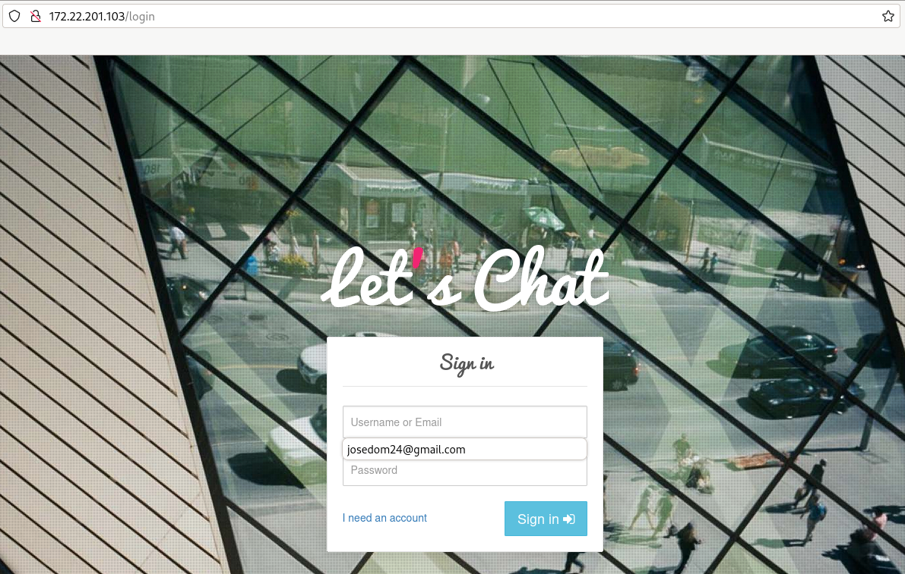

# El comando podman-compose

Vamos a usar la instrucción `podman-compose` para gestionar el ciclo de vida del escenario que tenemos definido en el fichero `compose.yaml`. 

Puedes encontrar los ficheros que vamos a utilizar en el directorio `modulo7/letschat` del [Repositorio con el código de los ejemplos](https://github.com/josedom24/ejemplos_curso_podman_ow).

**Es importante destacar que debemos ejecutar `podman-compose` en el directorio en el que se encuentra el fichero `compose.yaml`**.

## Despliegue de Let's Chat

[Let’s Chat](https://github.com/sdelements/lets-chat) es una aplicación web escrita en Node.js que utilizando una base de datos MongoDB nos posibilita la creación de salas de chats.

Accedemos al directorio donde se encuentra el fichero `compose.yaml` donde hemos definido el escenario para ejecutar la aplicación Let's Chat y  ejecutamos la siguiente instrucción para crear los contenedores:

```
$ podman-compose up -d
```

El parámetro `-d` de la instrucción `podman-compose up` nos permite ejecutar los contenedores de forma desatendida (similar al parámetro `-d` en `podman run`). 

Tenemos que tener en cuenta que si no tenemos las imágenes en nuestro registro local, se descargarán. Además podemos ver cómo se ha creado una red bridge definida por el usuario. Esta red se crea con el nombre del proyecto (en nuestro caso el indicado con el parámetro `name`, si no indicamos este parámetro el nombre será el del directorio donde se encuentra el fichero `compose.yaml`) y el termino `default`. También observamos que se ha creado un volumen, en este caso su nombre será el del proyecto unido al nombre que hemos indicado en su definición.

Podemos ver los contenedores que se están ejecutando:

```
$ podman-compose ps
CONTAINER ID  IMAGE                                  COMMAND     CREATED             STATUS             PORTS                   NAMES
2a98942af0c7  docker.io/library/mongo:4              mongod      About a minute ago  Up About a minute                          mongo
6416c812be81  docker.io/sdelements/lets-chat:latest  npm start   41 seconds ago      Up 39 seconds      0.0.0.0:8080->8080/tcp  letschat

```

Podemos acceder desde el navegador a la aplicación:




Veamos más comandos que podemos ejecutar con podman-compose:

* `podman-compose stop`: Detiene los contenedores que previamente se han lanzado con `podman-compose up`.
* `podman-compose run`: Inicia los contenedores descritos en el `compose.yaml` que estén parados.
* `podman-compose rm`: Borra los contenedores parados del escenario. Con las opción `-f` elimina también los contenedores en ejecución.
* `podman-compose pause`: Pausa los contenedores que previamente se han lanzado con `podman-compose up`.
* `podman-compose unpause`: Reanuda los contenedores que previamente se han pausado.
* `podman-compose restart`: Reinicia los contenedores. Orden ideal para reiniciar servicios con nuevas configuraciones.
* `podman-compose logs`: Muestra los logs de todos los servicios del escenario. Con el parámetro `-f` podremos ir viendo los logs en "vivo".
* `podman-compose logs servicio1`: Muestra los logs del servicio llamado `servicio1` que estaba descrito en el `compose.yaml`.
* `podman-compose exec servicio1 /bin/bash`: Ejecuta una orden, en este caso `/bin/bash` en el servicio `servicio1` que estaba descrito en el `compose.yaml`
* `podman-compose top`: Muestra  los procesos que están ejecutándose en cada uno de los contenedores de los servicios.


Para destruir los contenedores creados en el escenario podemos ejecutar la siguientes instrucción. Hay que indicar que `podman-compose` no borra la red que ha creado a diferencia de `docker-compose`.

```
$ podman-compose down
```

Si además queremos eliminar el volumen que se ha creado, usaremos el parámetro `-v`:

```
$ podman-compose down -v
```


