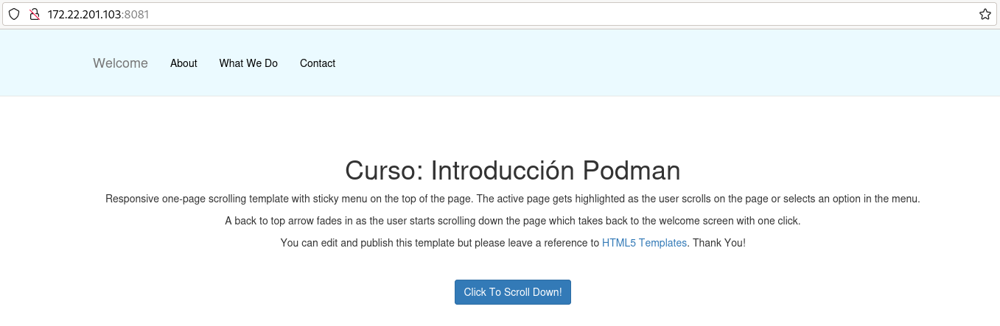

# Construcción de imágenes con podman build

Veamos como podemos automatizar la creación de imágenes OCI, usando un fichero `Containerfile` y el comando `podman build`. 

Puedes encontrar los ficheros que vamos a utilizar en el directorio `modulo8/estatica` del [Repositorio con el código de los ejemplos](https://github.com/josedom24/ejemplos_curso_podman_ow).

En este ejemplo vamos a construir distintas versiones de una imagen para servir una página web estática.

## Versión 1: Desde una imagen base

En el directorio de  **contexto** tenemos un fichero `Containerfile` y un directorio, llamado `public_html` con nuestra página web:

```
$ ls
Containerfile  public_html
```

En este caso vamos a usar una imagen base de un sistema operativo sin ningún servicio. El fichero `Containerfile` será el siguiente:

```
FROM debian:12
RUN apt-get update && apt-get install -y apache2 && apt-get clean && rm -rf /var/lib/apt/lists/*
WORKDIR /var/www/html/
COPY public_html .
EXPOSE 80
CMD apache2ctl -D FOREGROUND
```

* Al usar una imagen base `debian:12` tenemos que instalar los paquetes necesarios para tener el servidor web, en este caso Apache. 
* Además de la instalación del servicio hemos borrado todos los paquetes que nos hemos bajado, con esto conseguimos que la capa que va a crear la instrucción `RUN` sea lo más pequeña posible.
* A continuación añadiremos el contenido del directorio `public_html` al directorio `/var/www/html/` del contenedor, donde nos hemos posicionado con la instrucción `WORKDIR`. 
* Declaramos el puerto donde se va a ofrecer el servicio. Esta definición es sólo informativa.
* Finalmente indicamos el comando que se deberá ejecutar al crear un contenedor a partir de esta imagen: iniciamos el servidor web en segundo plano.

Para crear la imagen ejecutamos:

```
$ podman build -t josedom24/webserver:v1 .
```

* El parámetro de `-t` nos permite nombrar la imagen.
* Indicamos el directorio de contexto, en nuestro caso `.` porque estoy ejecutando esta instrucción dentro del directorio donde está el fichero `Containerfile`.

Comprobamos que la imagen se ha creado:

```
$ podman images
REPOSITORY                     TAG          IMAGE ID      CREATED         SIZE
localhost/josedom24/webserver  v1           0e1f90edc439  2 minutes ago   242 MB
...
```

Podemos ver cómo se ha creado cualquier imagen, usando el comando `podman history`:

```
$ podman history josedom24/webserver:v1 
ID            CREATED         CREATED BY                                     SIZE        COMMENT
2f2f9e80b41d  24 seconds ago  /bin/sh -c #(nop) CMD apache2ctl -D FOREGR...  0B          FROM f9624b30a221
<missing>     24 seconds ago  /bin/sh -c #(nop) EXPOSE 80                    0B          FROM 2f2f9e80b41d
<missing>     25 seconds ago  /bin/sh -c #(nop) COPY dir:3fceef1ec8e5fa7...  505kB       FROM a2d2c0d8ffd4
34982d620367  25 seconds ago  /bin/sh -c #(nop) WORKDIR /var/www/html/       0B          FROM 34982d620367
<missing>     29 seconds ago  /bin/sh -c apt-get update && apt-get insta...  120MB       FROM docker.io/library/debian:12
e15dbfac2d2b  12 days ago     /bin/sh -c #(nop)  CMD ["bash"]                0B          
<missing>     12 days ago     /bin/sh -c #(nop) ADD file:ca6d1f0f80dd6c9...  121MB 
```

Y podemos crear un contenedor:

```
$ podman run -d -p 8081:80 --name webserver1 josedom24/webserver:v1
```

Y acceder con el navegador a nuestra página:



### Uso de la caché en la construcción de imágenes OCI

Como hemos indicado anteriormente, durante la construcción de una imagen OCI, se van guardando en caché las capas intermedias que se van generando. Vamos a ver qué ocurre si volvemos a construir la imagen después de alguna modificación:

Si modificamos el fichero `index.html` y volvemos a construir la imagen:

```
$ podman build -t josedom24/webserver:v1 .
...
```
    
La construcción será muy rápida, ya que las imágenes intermedias que se van generando no se vuelven a generar porque están guardadas en caché. Sólo se ejecuta la instrucción donde copiamos el fichero que hemos modificado.

Cuando empezamos a construir nuestras propias imágenes, nos encontramos que al listar las imágenes aparecen algunas con el nombre y la etiqueta con el valor `<none>`. Estas son imágenes intermedias que se han generado y que no forman parte de ninguna imagen, por lo tanto pueden ocupar espacio en disco que no es necesario. Estas imágenes se llaman "colgadas" (dangling).

```
$ podman images
REPOSITORY                     TAG          IMAGE ID      CREATED         SIZE
localhost/josedom24/webserver  v1           aa1a19a3a7b0  8 seconds ago   193 MB
<none>                         <none>       a6582925a34d  31 seconds ago  193 MB
docker.io/library/debian       12           e15dbfac2d2b  12 days ago     121 MB
```

Para eliminar estas imágenes podemos ejecutar:

```
$ podman image prune
WARNING! This command removes all dangling images.
Are you sure you want to continue? [y/N]
```

## Versión 2: Desde una imagen con Apache

En este caso el fichero `Containerfile` sería el siguiente:

```
FROM docker.io/httpd:2.4
COPY public_html /usr/local/apache2/htdocs/
EXPOSE 80
```

* No necesitamos instalar nada, ya que la imagen tiene instalado el servidor web. 
* Siguiendo la documentación de la imagen en Docker Hub sabemos que el *DocumentRoot* del servidor web es el directorio `/usr/local/apache2/htdocs/`. 
* No es necesario indicar el `CMD` ya que por defecto el contenedor creado a partir de esta imagen ejecutará el mismo proceso que la imagen base, es decir, la ejecución del servidor web.

De forma similar, crearíamos una imagen y un contenedor:

```
$ podman build -t josedom24/webserver:v2 .
$ podman run -d -p 8082:80 --name websever2 josedom24/webserver:v2
```

## Versión 3: Desde una imagen con nginx

En este caso el fichero `Containerfile` sería:

```
FROM podman.io/nginx:1.24
COPY public_html /usr/share/nginx/html
EXPOSE 80
```

De forma similar, crearíamos una imagen y un contenedor:

```
$ podman build -t josedom24/webserver:v3 .
$ podman run -d -p 8083:80 --name webserver3 josedom24/webserver:v3
```

