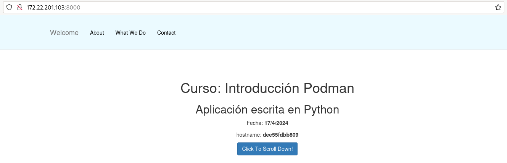

# Construcción de imágenes con Compose

En este ejemplo vamos a ver la configuración de Compose para construir la imagen que va a utilizar en la creación del servicio. En este caso no se indica la imagen desde la que se crea el contenedor, se indica el directorio de contexto donde encontramos el fichero `Containerfile` para la construcción de la imagen.

Puedes encontrar los ficheros necesarios para realizar este ejemplo en el [Repositorio con el código de los ejemplos](xxx).

## Construcción de imagen con una aplicación Python

En este ejemplo vamos a crear una imagen a a partir de una aplicación Python construida con el framework Flask. El código de la aplicación lo encontramos en la carpeta `app`.

El fichero `Containerfile` que vamos a usar para la construcción de la imagen tiene el siguiente contenido:

```Dockerfile
FROM docker.io/python:3.12.1-bookworm
WORKDIR /usr/share/app
COPY app .
RUN pip install --no-cache-dir -r requirements.txt
EXPOSE 3000
CMD python app.py
```

* En este caso vamos a usar una imagen `python` para crear la nueva imagen.
* Con `WORKDIR` nos posicionamos en el directorio indicado. Todas las instrucciones posteriores se realizarán sobre ese directorio.
* Copiamos la aplicación en dicho directorio.
* Instalamos las dependencias necesarias. En el fichero `requirements.txt` tenemos las dependencias necesarias para que el programa funcione.
* La aplicación ofrece el servicio en el puerto 3000/tcp.
* Indicamos la instrucción que se debe ejecutar para iniciar el servidor web.


Por último el fichero `compose.yaml` que vamos a usar para levantar el escenario tendrá el siguiente contenido:

```yaml
version: '3.1'
services:
  app:
    container_name: aplicacion_python
    build: build
    restart: always
    ports:
      - 8000:3000
```

* Como podemos observar, en el servicio `app` no hemos indicado la imagen. 
* Hemos indicado el directorio de contexto, en nuestro caso el directorio `build`, en el parámetro `build:`. 
* Al levantar el escenario con `podman-compose`, si es necesario se construirá la imagen que vamos a usar para crear el contenedor. 

Vamos a construir la aplicación:

```
$ sudo podman-compose up -d
```

Como vemos para crear el servicio `app` se realiza el proceso de construcción de la imagen a a partir del fichero `Containerfile`. Podemos acceder a la aplicación:



Evidentemente si borramos el escenario y volvemos a acceder no será necesario de nuevo la construcción de la imagen. Si se produce un cambio en la aplicación o en el fichero `Containerfile`, la próxima vez que levantemos el escenario tendremos que indicar que queremos volver a construir la imagen con el parámetro `--build`. Por ejemplo, hemos cambiado el mensaje que muestra la aplicación en la función principal de la aplicación, borramos el escenario y lo volvemos a crear indicando que queremos volver a construir la imagen del servicio `app`:

```
$ sudo podman-compose down
$ sudo podman-compose up -d --build 
```


